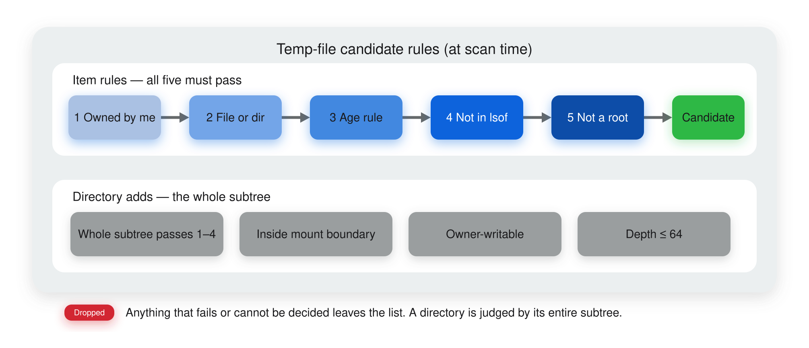
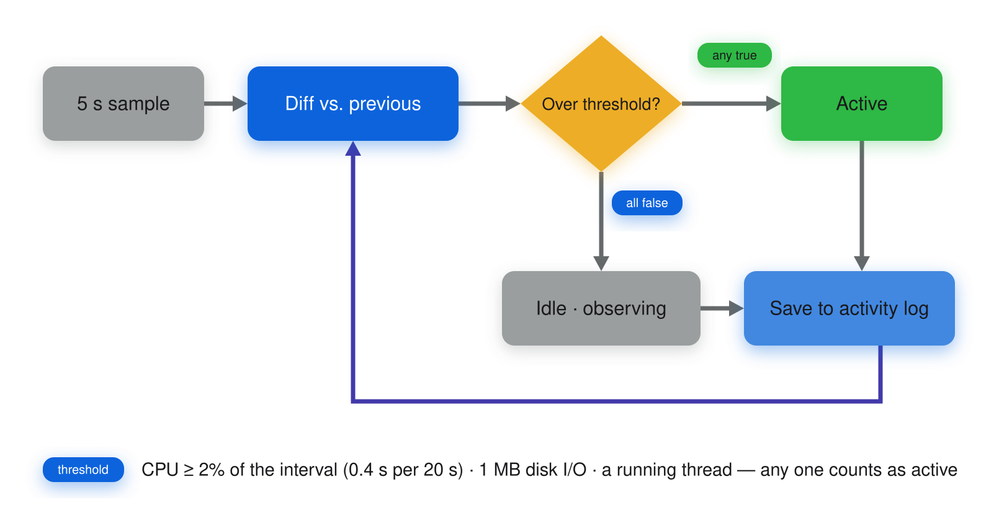
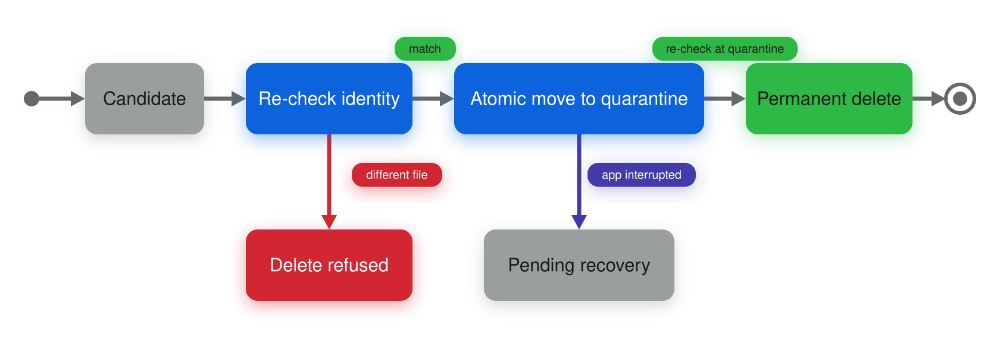

# DiskTidy

- Author: JunyoungJung
- Latest version: **1.5.2** (2026-09-03)
- Distribution: direct DMG · ad-hoc signed (not notarized by Apple)
- Requires: macOS 14 or later
- License: [MIT](LICENSE) · [한국어](README.md) · [Contributing](CONTRIBUTING.md)

A macOS disk-cleanup utility. Review and clear app caches, simulators, build caches, package caches, temp files, large files and dev daemons from one window.

It only collects the things that actually grow by gigabytes on a development machine, and **every irreversible deletion follows a rule that is written down here first**. Section 3 spells out why any given entry became a candidate.

> The app UI is currently Korean-only. Localization contributions are welcome.


## Find it fast

| What you want to know | Start here |
|---|---|
| Which screens exist and what they show | [1. Screens at a glance](#1-screens-at-a-glance) |
| Installing and the first launch (Gatekeeper) | [2. Installation](#2-installation) |
| What becomes a candidate and what is filtered out | [3. Cleanup rules](#3-cleanup-rules) |
| Trash or permanent delete | [4. Deletion policy](#4-deletion-policy) |
| The AI assistant and what leaves your machine | [5. AI assistant](#5-ai-assistant) |
| Why the window hides behind other apps | [6. Window behavior](#6-window-behavior) |
| Where things live in the source | [7. Source layout](#7-source-layout) |
| Why it is built this way | [8. Design notes](#8-design-notes) |

### What changed in 1.5.2

The four list screens (caches · temp files · simulators · dev daemons) got a new interaction model. It started from feedback that the buttons at the bottom of the window went unnoticed → [1.2](#12-working-with-lists)

- **Selection lives in the list header.** A tri-state checkbox (`☐` none / `[-]` some / `☑` all) replaces the old "Select all · Deselect all" buttons at the bottom. Pressing it while some rows are selected clears the selection. Keyboard: ⌘⇧A.
- **Destructive actions moved to the top right.** Move to Trash · Delete permanently · Quit daemon · Delete device sit on the title row and turn **orange only when something is selected**.
- **Column headers, click to sort.** Name · modified · size (runtime and last-used for simulators, memory for dev daemons), toggling ascending/descending.
- **Search narrows the view.** Lists with hundreds of entries filter by name, path or verdict. Filtering never changes what is selected, and the header checkbox only touches **visible** rows.
- **Deletion progress and cancel.** A multi-gigabyte entry can take seconds on its own, so deletion reports `3/12` and cancelling skips only entries that have not started → [4](#4-deletion-policy)
- **Size share bars** show at a glance that a few entries account for most of the list.
- Right-click a row for **Show in Finder · Copy path** (PID and executable path for processes, UDID for simulators).
- Fixes: the dev-daemon tab used to select processes it cannot quit, producing "8 selected · 0 quittable"; the cache tab showed no modification dates; an empty list painted a blank rectangle over the screen.

> The screenshots still show the 1.5.1 layout with the bottom buttons. They will be retaken in a follow-up commit.

### What changed in 1.5.1

- **The dev-daemon tab now shows activity signals.** Every process carries its start time, cumulative CPU, last activity and the app that launched it, with a green badge while it is working → [3.5](#35-dev-daemon-activity-signals)
- The temp-files tab moved up the sidebar (right under SSD usage). Agent scratch data piles up in tmp by the gigabyte, which made it the most-used tab.
- The `dart` process description was corrected — most processes named `dart` are Dart MCP servers, one per agent session.

---

## 1. Screens at a glance

**Twelve screens** in a sidebar, plus a persistent menu-bar item and an AI assistant inspector on the right. Reopening a tab shows the previous scan results immediately while a fresh scan runs in the background.

The sidebar is always open at a fixed width. While it collapses and expands, macOS re-lays out the toolbar and flashes the overflow indicator (») for a frame; this reproduces even with every toolbar item removed, so the app cannot prevent it (measured). With only twelve tabs there is nothing to gain by collapsing it.

| Screen | Contents |
|---|---|
| SSD usage | Total / used / free capacity and usage percentage |
| Temp files | Top-level entries in `/private/tmp` and `$TMPDIR` ([safety rules](#34-temp-file-safety-rules)) |
| App caches | Per-app directories under `~/Library/Caches` |
| Simulators | iOS simulators sorted by last use; delete device or erase data. [Test clones and runtimes](#33-simulator-test-clones-and-runtimes) are managed here too |
| Project caches | Recursive scan for build caches under folders you pick ([rules](#31-project-cache-detection-rules)) |
| Xcode caches | `DerivedData`, iOS/watchOS/tvOS DeviceSupport, Archives. Reads them even when symlinked to an external drive |
| Large files | Files over 200 MB under folders you pick (defaults to `~/Downloads`) |
| Android caches | Gradle caches and distributions, `~/.android` caches, Android Studio IDE caches |
| Android emulators | AVDs in `~/.android/avd`; deletion also clears the `.ini` pointer |
| Dev daemons | Memory and swap metrics, terminate long-running dev daemons, plus per-process [activity signals](#35-dev-daemon-activity-signals) |
| Package caches | Global caches for npm, pnpm, Bun, Yarn, CocoaPods, SwiftPM, Carthage, pip, uv, Cargo, Homebrew ([paths](#32-package-cache-paths)) |
| Settings | AI provider connection, local CLI provider opt-in, file access permissions, window behavior (always on top), developer contact |

### 1.1 Screenshots

| | |
|---|---|
| **Temp files** — only entries that pass the safety rules<br> | **Dev daemons** — start time, CPU, last activity, launching app<br> |
| **App caches** — `~/Library/Caches` by size<br> | **Simulators** — least recently used on top<br> |
| **Project caches** — recursive build-cache scan<br> | **Large files** — files over 200 MB<br> |
| **Android caches** — Gradle · Android Studio<br> | **Android emulators** — AVD list<br> |
| **Settings** — AI provider setup and window behaviour<br> | **AI assistant** — opens as a trailing inspector<br> |

The menu-bar item shows SSD usage, refreshed every 60 seconds. Clicking it opens a minimal dropdown with a gauge plus Open / Quit.


> These are real screenshots from daily use. Only the personal parts — cache entry names and project paths — are blurred.
> The temp-files and large-files screens are exceptions: nothing met the criteria when they were taken, so qualifying dummy entries were created for the shots.
> The settings screen has the **local CLI provider** opt-in switched on — that is a development-build-only path, and the provider does not appear in the dropdown in release builds.

### 1.2 Working with lists

The four screens with lists (caches · temp files · simulators · dev daemons) behave identically.

| Where | What |
|---|---|
| Right of the title | Search · selection summary · Refresh · **action button** |
| List header | Tri-state select-all checkbox + clickable column titles |
| Row | Checkbox · name (full path in the tooltip) · column values · size share bar · `ⓘ` explanation button |
| Right-click a row | Show in Finder · Copy path (PID and executable path for processes, UDID for simulators) |

- The **selection summary** shows the size of the whole list while nothing is selected (`125 items · 5.04 GB`) and the selected total afterwards (`3 selected · 1.2 GB`).
- The **action button is orange only while something is selected.** Disabled it is a plain bordered button, so colour alone tells you whether it can be pressed.
- The **header checkbox is tri-state**: `☐` nothing, `[-]` some, `☑` all. Pressing it from `[-]` or `☑` clears the selection. The shortcut is ⌘⇧A — ⌘A is left to the AI assistant's text field.
- **Rows that cannot be selected are excluded from the denominator.** Temp files in use and processes that cannot be quit are never part of select-all, so selecting everything does not get stuck at `[-]`.
- **Search only narrows the view.** Selected rows stay selected while hidden (the summary count still counts them), and the header checkbox only toggles visible rows.
- **Sorting is view-only.** It changes neither the scan result nor the deletion targets. Defaults differ per screen: size descending (caches, temp files), last used ascending (simulators), memory descending (dev daemons).
- The temp-files tab keeps its source groups (Claude session · Codex build output · agent scratch · other) and sorts **within** a group only. Group order encodes risk, so it is not the user's to change.

---

## 2. Installation

### 2.1 Requirements

- macOS 14 or later
- To build from source: Xcode 26 or later — the MarkdownView 3.0.0 dependency requires the Swift 6.2 toolchain. Tests use Swift Testing
- macOS prompts for file access (TCC) on first run — Documents and Downloads, plus Desktop and external volumes if scan roots point there, all asked once right after launch. Turning on Full Disk Access under **Settings › File access** stops the per-folder prompts

### 2.2 Download (DMG)

Grab `DiskTidy-<version>.dmg` from [Releases](../../releases), open it, and drag `DiskTidy.app` onto `Applications`.


Verify integrity:

```bash
shasum -a 256 -c DiskTidy-1.5.1.dmg.sha256
```

### 2.3 First launch (Gatekeeper)

This app is **ad-hoc signed (free) and therefore not notarized by Apple.** macOS will block the first launch with the warning below. That is expected.


> **Do not click Move to Trash.** Click `Done` and follow the steps below.

| macOS | How to allow it |
|---|---|
| 15 Sequoia and later | ① Launch `DiskTidy.app` once, dismiss the block warning ② **System Settings → Privacy & Security** ③ Scroll to the DiskTidy entry and click **"Open Anyway"** (Apple removed the right-click → Open bypass) |
| 14 Sonoma | **Right-click → Open** once; subsequent launches work normally |
| Terminal (any version) | `xattr -dr com.apple.quarantine /Applications/DiskTidy.app` |

To inspect the signature before trusting it:

```bash
codesign -dv --verbose=4 /Applications/DiskTidy.app
```

Each build generates a fresh ad-hoc signature, so macOS may re-ask for folder permissions (TCC) after reinstalling. Full Disk Access is dropped silently rather than re-asked, so if lists come up empty after an update, check **Settings › File access** and re-enable it in System Settings.

### 2.4 Build from source

```bash
./Scripts/run.sh          # dev mode (release build, runs immediately, shows a Dock icon)
swift test                # tests

./Scripts/build-app.sh    # release build → DiskTidy.app → installs to /Applications
./Scripts/make-dmg.sh     # release build → dist/DiskTidy-<version>.dmg + .sha256
./Scripts/make-app.sh     # DiskTidy.app bundle only (no install, no packaging)
./Scripts/generate-icon.sh  # regenerate the app icon
```

`LSUIElement=true` in `Info.plist` means the installed `.app` lives only in the menu bar, with no Dock icon (dev mode via `run.sh` is unaffected).

The icon pipeline renders a 1024px PNG from an SF Symbol with AppKit (`Scripts/generate-icon.swift`), resizes it with `sips`, and packs `Resources/AppIcon.icns` with `iconutil`. To change the design, edit the background color or symbol name in `generate-icon.swift` and run it again.

> **If you fork:** change `CFBundleIdentifier` in `Info.plist` (`com.jimmy.disktidy`) and the logger subsystem in `TrashService`, `PermanentDeleter` and `TempCleanupViewModel` to your own. To notarize, you need an Apple Developer Program membership ($99/year), then `codesign --options runtime --sign "Developer ID Application: ..."` plus `xcrun notarytool submit`.

---

## 3. Cleanup rules

### 3.1 Project cache detection rules

Directories whose names unambiguously mean "build cache" are matched by name. Generic names require a marker file in the parent directory.

| Rule | Directories | Condition |
|---|---|---|
| By name | `Pods` `DerivedData` `.gradle` `Carthage` `.dart_tool` `.next` `.expo` | none |
| Marker required | `node_modules` `dist` | `package.json` in parent |
| Marker required | `target` | one of `Cargo.toml` `pom.xml` `build.gradle` `build.gradle.kts` |
| Marker required | `build` | one of `package.json` `build.gradle` `build.gradle.kts` `CMakeLists.txt` `pom.xml` |
| Marker required | `.build` | `Package.swift` in parent |

`build`, `dist`, and `target` can be committed source directories, so they are left alone without a marker. Overly broad scan roots (`/`, `~`, `/Users`, …) are rejected.

### 3.2 Package cache paths

The project-cache tab only looks *inside* projects (`node_modules`, `Pods`). What actually grows by gigabytes are the global caches in your home directory, and no tab was showing them — so they get their own tab. Gradle belongs to the Android caches tab and is excluded here.

| Tool | Path |
|---|---|
| npm | `~/.npm/_cacache` |
| pnpm | `~/Library/pnpm/store` |
| Bun | `~/.bun/install/cache` |
| Yarn | `~/Library/Caches/Yarn` |
| CocoaPods | `~/.cocoapods/repos`, `~/Library/Caches/CocoaPods` |
| SwiftPM | `~/Library/Caches/org.swift.swiftpm` |
| Carthage | `~/Library/Caches/org.carthage.CarthageKit` |
| pip | `~/Library/Caches/pip` |
| uv | `~/Library/Caches/uv` |
| Cargo | `~/.cargo/registry` |
| Homebrew | `~/Library/Caches/Homebrew` |

**Only cache subpaths are targeted, never the tool root.** `~/.cargo` holds `credentials.toml` and `~/.cocoapods` holds configuration; wiping the root would take out things that never come back. Every listed path is the "re-downloaded on the next install" kind. Paths that do not exist never appear in the list.

### 3.3 Simulator test clones and runtimes

Two extra sections sit above the device list. Both go through `simctl`, so neither is reversible and both require a confirmation dialog.

- **Test clones (`~/Library/Developer/XCTestDevices`)** — Xcode creates simulator clones for every parallel test run and never removes them afterwards, so they pile up into hundreds of gigabytes. Their names are all UUIDs, so instead of a list you get a count, a total, and a last-used date, plus one `simctl --set testing delete all` button. The next parallel test run recreates whatever it needs. The size comes from **walking the disk**, not from the `--set testing` listing — orphaned clones whose runtime was deleted drop out of that listing but still occupy disk.
- **Runtimes (OS disk images)** — read via `simctl runtime list`, grouped by platform with the newest version on top. Anything with a newer version installed for the same platform gets a **superseded** badge as a deletion hint. Versions are compared numerically, not as strings (`26.3.1` < `26.5`). `simctl` deletes runtimes in the background, so it is normal for a runtime to linger in the list as `Deleting` after the call succeeds. Deleted runtimes can be re-downloaded from Xcode Settings → Components.

### 3.4 Temp-file safety rules

`/tmp` is a shared directory. Its top level mixes unix sockets, files owned by other users, and markers that are still in use. An entry becomes a deletion candidate only if it passes **all five** rules. Anything that cannot be decided is dropped from the list.



| # | Rule |
|---|---|
| 1 | Owned by me (`st_uid == getuid()`) |
| 2 | Regular file or directory — sockets, FIFOs and symlinks are excluded |
| 3 | Age rule by origin — **Claude session scratch, Codex build output and agent junk files** need the session to be over (decided from three signals: the live Claude process's session record, transcript freshness, and a resumable session in the same project) or no build process holding them, plus `mtime` older than 30 minutes. **Everything else** needs both `atime` and `mtime` older than 24 hours |
| 4 | Not reported as an open path by `lsof` |
| 5 | Not a root directory itself |

A directory must pass rules 1–4 for its **entire subtree**, not just itself. One socket or one open file anywhere inside removes the whole directory from the list.

**Agent output is candidate-scoped differently.** `/private/tmp/claude-<uid>` is never taken as a whole; the scan descends to `<project>/<session UUID>` directories, because taking the parent would delete the working files of a session that is running right now. Live sessions and DerivedData a build still references appear as greyed-out rows that cannot be selected. The reasoning is in [`docs/temp-cleanup.md`](docs/temp-cleanup.md) §3-A.

Three more guards apply:

- **Mount boundaries are never crossed.** The candidate and every entry below it must share the root's `st_dev`. Renaming a directory that *contains* a mount point succeeds, so without this the recursive delete would reach into the mounted volume.
- **Directories without owner write permission are not candidates.** A `0555` directory can be listed but its children cannot be unlinked. Deletion is not atomic, so it would stop halfway — and the changed mtime then blocks restore as well.
- **Subtree depth is capped at 64.** Beyond that the entry is treated as undecidable and dropped.

#### Observation limits

- **Non-root `lsof` cannot fully see file handles held by root or other users' processes.** A file such a process is holding may look closed.
- **`atime` does not prove a recent read.** Filesystems may not update it, so it is never treated as proof of use — only as an additional gate.
- In other words this feature conservatively filters on **state observable from user space only**. Its threat model does not include a hostile process running as the same UID.
- **App Sandbox / Mac App Store distribution is not supported.** Access to `/private/tmp` assumes a directly distributed app with no entitlements.
- If `lsof` or root enumeration fails, the result is an **error**, not an empty list. The list is cleared and a warning banner is shown so the delete button never opens on unverified entries.

### 3.5 Dev-daemon activity signals

*(new in 1.5.1)* The list answers "is this daemon in use right now, and when did it last do work?" macOS has no "last used" value for a process, so the app **observes** it.

| Signal | Source | What it tells you |
|---|---|---|
| Start time · uptime | process start time from `ps` | whether it has been up for days |
| Cumulative CPU (s) | `proc_pidinfo(PROC_PIDTASKINFO)`, mach units converted via timebase | how much work it has actually done |
| Cumulative disk I/O | `proc_pid_rusage(RUSAGE_INFO_V4)` | whether it writes files without burning CPU |
| Running threads | `pti_numrunning` | the only signal available on the first observation |
| Launching app | parent PID → first `.app` in its executable path | who started it (Xcode, Visual Studio Code, Claude Code, …) |

The row badge is one of four:

| Badge | Meaning |
|---|---|
| **활동 중** (active, green) | Since the previous sample, CPU rose by at least 2% of the interval (0.4 s per 20 s), or disk I/O by at least 1 MB, or a thread is running |
| **유휴 N** (idle for N) | Time since the last sample where the above was true |
| **관찰 중** (observing) | The tab has been open for under a minute — not enough samples yet |
| **관찰 N 동안 활동 없음** | No activity at all for the whole observation window |



- **Below 2% CPU does not count as activity.** An idle JVM still spends tens of milliseconds per interval on GC and JIT cleanup (measured); without the threshold everything reads as active.
- **It is observation-based, so it only accumulates while the tab is open.** Samples run every 5 seconds and the list refreshes every 20; a refreshed list keeps the record as long as the process matches (PID + start time).
- The `I` state character from `ps` (idle for 20+ seconds) is **not used** — measured: daemons idle for three hours all reported `S`.
- Sampling never re-runs `ps`; it issues syscalls against the PIDs already in the list, re-checking the start time first in case the PID was reused.

Design details and the measurements behind them are in [`docs/memory-cleanup.md`](docs/memory-cleanup.md).

---

## 4. Deletion policy

| Target | Method | Reversible |
|---|---|---|
| App caches, project caches, Xcode caches, large files, Android caches, Android emulators, package caches | moved to Trash (`FileManager.trashItem`) | yes |
| Simulator delete / erase | `xcrun simctl delete` / `erase` | no — confirmation dialog |
| Simulator test clones and runtimes | `simctl --set testing delete all` / `simctl runtime delete` | no — confirmation dialog |
| Temp files | **permanent delete** | no — confirmation dialog |
| Dev daemons | `SIGTERM` → `SIGKILL` | no — the tool may relaunch it |

**Temp files are the one target that skips the Trash.** Trashed files reclaim no disk blocks until the user empties it, which defeats the purpose of the tab. The procedure instead is:

1. Keep the scan-time `st_dev + st_ino + uid + mode + mtime + atime`.
2. Re-check it against the parent directory FD right before deletion.
3. Atomically move the entry into a dedicated quarantine directory on the same volume with `renameatx_np(RENAME_EXCL)`.
4. Delete it only if the identity still matches at the quarantine location.

If the app dies mid-move, the quarantined entry shows up in a **pending recovery** list on the next launch and is never removed automatically.



- A successful deletion means "the path was removed". APFS snapshots or open files can delay the free-space increase, so the UI reports the number of deleted paths and the freshly read free space **separately**, and promises no amount reclaimed.
- Failures (insufficient permissions, files in use, booted simulators) surface as an in-app warning banner and the item stays in the list. Details go to Console.app under the `com.jimmy.disktidy` subsystem.

**Progress and cancel** *(new in 1.5.2)* — deletion processes one entry at a time and reports `3/12`. Cancelling **skips only entries that have not started yet.**

| Screen | Entries already processed when you cancel |
|---|---|
| Caches (move to Trash) | Still in the Trash — you can put them back |
| Temp files (permanent delete) | Gone — cancelling only protects what is left |

A single entry (a trash move, a quarantine-plus-delete) is never split. Cancellation is only observed **between** entries, so a half-deleted directory never happens. When deletion ends, the banner and summary state how many entries were skipped.

---

## 5. AI assistant

The speech-bubble toolbar button — or **View → Show Inspector (⌃⌘I)** — opens the trailing inspector. It is the standard macOS inspector, so the show/hide animation, the drag-to-resize edge and width persistence all come from the system.

It answers **from the screen you are currently looking at** — item count and total, selection state, the top 40 rows, scan state, error banner, and how that screen deletes things are rebuilt on every question and sent as the system prompt. Tabs register a snapshot function rather than a value, so asking after a scan finishes describes the current list, not an empty one.

**The assistant cannot operate the app.** No tool calling is wired up. Deleting, erasing and terminating always require you to press the button yourself, confirmation dialogs included.

### 5.1 Provider setup

| Provider | Default root | Wire format |
|---|---|---|
| Anthropic (Claude) | `https://api.anthropic.com` | Messages API |
| OpenAI | `https://api.openai.com` | Chat Completions |
| OpenAI-compatible (custom) | you provide | Chat Completions |

The app appends the version path (`/v1/messages`, `/v1/chat/completions`). Enter the root only; a trailing slash, a `/v1`, or a full endpoint path copied from the docs is absorbed. HTTP requests time out after 60 seconds.

**Local models connect through the OpenAI-compatible provider.** A dedicated Ollama provider existed and was removed — a single 8B model held 18 GB of memory and its model cache took 17 GB, which is not something a disk-cleanup utility should ask of you. Instead, point **OpenAI-compatible (custom)** at `http://localhost:<port>` and LM Studio, llama.cpp or an Ollama server all work. Which one to run is your call.

**Models are picked from a dropdown.** The settings screen fetches `GET /v1/models` when it opens (both wire formats return the same shape). Embedding, speech, image and moderation models are filtered out — picking one only produces a failure. Turn on manual entry for names that are not in the list, such as an internal gateway or a preview model. Listing does not require a model name; not knowing the name is the reason to list.

**API keys are the default.** The app does not proxy subscription credentials. Anthropic [explicitly does not permit](https://code.claude.com/docs/en/legal-and-compliance) third-party developers to offer claude.ai login or to route requests through Free/Pro/Max credentials on their users' behalf, and reserves the right to enforce without notice; ChatGPT subscriptions likewise do not include API usage (separate billing). To run without a key, turn on the local CLI path below yourself.

### 5.2 Item explanation button (ⓘ)

Every list row has an ⓘ button that opens a popover explaining what the item is and whether it is safe to delete.

**Items the app already knows are never sent to AI** — most listed paths were put there by the app itself (e.g. `~/.gradle/caches`), so asking a model to guess their identity is slower, costlier and less accurate. Entries in `KnownItemCatalog` (DerivedData, Archives, DeviceSupport, Gradle caches, …) show instantly with no AI configured; only unfamiliar paths in the large-file and temp-file tabs and unknown processes go to the model. Answers are cached, so pressing the same item again does not re-ask.

### 5.3 Local CLI providers (opt-in)

Settings → **local CLI providers** adds two providers to the list. It is off by default and asks for confirmation once when you turn it on.

- **Claude Code CLI · subscription login**
- **Codex CLI · subscription login**

Each runs the official CLI you are already logged into as a child process and uses its output as the answer:

```
claude -p <whole transcript> --model sonnet \
       --output-format stream-json --include-partial-messages --verbose \
       --append-system-prompt <system prompt incl. screen snapshot> \
       --disallowed-tools Bash Edit Write NotebookEdit WebFetch WebSearch Task Read Glob Grep \
       --strict-mcp-config

codex exec --json --sandbox read-only --skip-git-repo-check --ephemeral \
       <rules + screen snapshot + whole transcript>
```

What it deliberately does **not** do matters more: it never reads subscription OAuth tokens and never spoofs client headers. That pattern is blocked server-side and is grounds for account suspension. This runs the same command you would type in a terminal, under the same credentials, and the app never sees or stores them.

Requests still go out **on your subscription**, so whether each provider's terms allow it is yours to verify — hence the default-off switch and the confirmation. This cannot ship through the App Store (the sandbox forbids executing external binaries); direct DMG distribution only.

Guardrails: Claude Code gets every tool denied (the screen snapshot is already in the prompt, and an open tool would let this app edit files or run commands) plus `--strict-mcp-config`. Codex has no switch to disable tools wholesale, so it runs under `--sandbox read-only` and `--ephemeral` (no session files). Both use `$TMPDIR` as the working directory and a 180-second timeout.

**Streaming differs per tool.** Claude Code streams token by token (without `--include-partial-messages` only completed blocks arrive, which collapses into one chunk). Codex has no delta option in `codex exec --json`, so the reply appears at once — a progress indicator holds the answer's place until then.

**Models**: Claude Code takes CLI aliases (`sonnet`, `opus`, `haiku`). For Codex, **leave the model field empty** to use whatever `~/.codex/config.toml` selects — the valid set depends on account type and CLI version, so the app does not choose for you.

**Executable path**: log in once in a terminal, then put the output of `which claude` (or `which codex`) into the CLI executable path field in Settings. The default scans common install locations and nvm version directories, because a GUI-launched app only has `PATH=/usr/bin:/bin`. CLIs installed via npm are `#!/usr/bin/env node` shims that also need `node`, so the child process gets the executable's own directory prepended to `PATH`.

### 5.4 What leaves your machine

- **Sent** — each question sends that screen's **item names, paths, sizes and selection state** to the provider you chose. File contents are never sent. To keep everything on-device, point the OpenAI-compatible provider at a local server (`http://localhost:…`).
- **Key storage** — API keys live in the macOS keychain (`com.jimmy.disktidy.ai`), one entry per provider. `UserDefaults` holds only the provider, root URL and model. Ad-hoc signed builds change signing identity on every build, so the keychain will re-prompt for access.
- **Plaintext HTTP** — requests are never sent over plaintext `http` to a remote host (key exposure). `http` is allowed for loopback (`localhost`, `127.0.0.1`, `::1`) only.

### 5.5 Answer rendering

Answers render with [MarkdownView](https://github.com/LiYanan2004/MarkdownView) — chosen for incremental streaming parsing and text selection across blocks — with two defaults changed.

- **Remote images are never fetched**: file paths in the screen snapshot could steer the model into emitting ``, which would leak the path the moment the answer renders.
- **Syntax highlighting and math rendering are off**: the library's default style locates resources via `Bundle.module`, and in an ad-hoc-signed app shipping that bundle in the `.app` root breaks codesigning while omitting it crashes on other machines (measured).

Messages you type stay verbatim, so a `*` you wrote is not eaten as formatting. Answers are capped at 1024 tokens; when the cap truncates a reply the app appends `(답변이 길이 제한으로 잘렸습니다.)` — a truncated answer must not read as a complete one.

---

## 6. Window behavior

With no Dock icon (`LSUIElement`), a window that slips behind another app is unreachable. So opening the window handles activation, front ordering and Space placement together, and **always on top** is on by default (turn it off under Settings → Window).

Activation alone measurably is not enough: when another app is full-screen it owns the active Space and our window stays on a different one — `lsappinfo` reports DiskTidy as frontmost and `CGWindowList` puts the window inside screen bounds, yet a screenshot captures only the full-screen editor. So the window level goes to `.floating` with `canJoinAllSpaces` and `fullScreenAuxiliary` (or `.normal` + `moveToActiveSpace` when always-on-top is off). Right after launch SwiftUI may not have created the window yet, so the presenter retries briefly until it exists.

---

## 7. Source layout

```
DiskTidy/
  Package.swift
  Info.plist
  LICENSE                  # MIT
  README.md / README.en.md
  CONTRIBUTING.md
  .github/workflows/
    ci.yml                 # build + test + zero-warning check
    release.yml            # builds the DMG and attaches it on a v* tag push
  docs/
    screenshots/           # README screenshots
    diagrams/              # README SVG diagrams (Korean plus `.en` English, light and dark aware)
    memory-cleanup.md      # dev-daemon tab design (process classification, activity signals)
    temp-cleanup.md        # temp-files tab design (safety rules, quarantined deletion)
  Resources/
    AppIcon-1024.png       # icon source PNG
    AppIcon.icns           # icon shipped in the app
    AppIcon.iconset/       # intermediate output (git-ignored, regenerated by generate-icon.sh)
  Scripts/
    run.sh                 # dev-mode run
    make-app.sh            # builds the DiskTidy.app bundle (shared by the two below)
    build-app.sh           # make-app.sh + install into /Applications
    make-dmg.sh            # make-app.sh + dist/DiskTidy-<version>.dmg + .sha256
    generate-icon.sh       # full icon pipeline
    generate-icon.swift    # icon PNG renderer
  dist/                    # DMG output (git-ignored)
  Sources/DiskTidy/
    DiskTidyApp.swift      # @main, WindowGroup + MenuBarExtra
    Models/                # CleanableItem, TempCandidate, SimulatorItem, StorageSnapshot,
                           #   RunningProcess (+ ProcessUsage, ProcessActivity),
                           #   AppNavigationState + AI (AIProvider, AIChatMessage,
                           #   ScreenContext, ChatContextStore, KnownItemCatalog)
    Services/              # scanners + shared helpers (ShellRunner, DiskScanner, TrashService,
                           #   RootFolderStore, FileAttributes, StorageInfo, StorageMonitor,
                           #   DirectoryContents)
                           #   + temp-only (TempRootPolicy, TempScanner, PermanentDeleter)
                           #   + processes (ProcessScanner, ProcessTerminator)
                           #   + AI (APIKeyStore, SettingsStore, AIRequestBuilder,
                           #   AIStreamParser, AIChatClient, AIModelCatalog, AIChatError,
                           #   AICLIClient, AICLIStreamParser)
    ViewModels/            # CleanableListViewModel (shared by cache tabs), SimulatorViewModel,
                           #   RootFolderViewModel, TempCleanupViewModel, MemoryViewModel,
                           #   AISettingsViewModel, ChatViewModel, ScreenContextBuilder,
                           #   ItemExplanationStore
    Views/                 # ContentView (fixed sidebar + AI inspector toggle) + per-screen tabs +
                           #   shared components (ListChrome: header bar, column header,
                           #   tri-state checkbox, sorting, share bars;
                           #   CleanableListView, RootFolderPicker, ErrorBanner,
                           #   WindowPresenter)
                           #   + AI (SettingsTabView, ChatPanelView, ChatMarkdownStyle,
                           #   ExplanationButton, ScreenContextModifier)
  Tests/DiskTidyTests/     # Swift Testing
```

---

## 8. Design notes

- **`ShellRunner` discards stderr via `FileHandle.nullDevice`.** With a `Pipe`, once the child fills the 64 KB pipe buffer it blocks on write while the parent waits forever reading stdout. `find`'s "Permission denied" output alone exceeds that, and the app really did hang. Covered by a regression test.
- **`DiskScanner.sizes(of:)` batches paths into one `du -sk` call.** Spawning one process per entry means 100+ fork/exec calls for `~/Library/Caches` alone.
- **Six cache tabs share a single `CleanableListViewModel`,** injecting only the scanner closure. Scanning and deletion both run off the main thread, and refresh is guarded against re-entry.
- **Tab view models are owned by `TabViewModels` (window lifetime), not by the views.** A per-view `@StateObject` is destroyed the moment you leave the tab, so every re-entry rescanned from a blank screen. With the container, re-entering shows the previous results instantly and only the rescan runs in the background. The daemon tab's polling timer runs only while the tab is visible — moving the view model to window lifetime would otherwise have made it poll forever, so the timer is tied to visibility via `startPolling()`/`stopPolling()`.
- **The temp-files tab is the one tab that does not use `CleanableListViewModel`.** `CleanableItem.id` is a fresh `UUID()`, so it does not preserve file identity as of the scan. Using it for an irreversible delete would remove whatever file happens to carry that name at deletion time. `TempCandidate` carries the raw `lstat` values instead, with its own view model and view.
- **`lsof` runs exactly once per scan.** `lsof +D /private/tmp` walks the whole tree and is unusable. `lsof -w -n -F0n -u <uid>` returns every open path for the user's processes as NUL-terminated fields in one shot (measured: 1.2 s, ~89,000 fields). Parsing line by line breaks on filenames containing newlines.
- **Activity sampling never re-runs `ps`.** It issues two syscalls (`PROC_PIDTASKINFO`, `proc_pid_rusage`) against the PIDs already listed. The sample timestamp is taken **before** collection: stamping it on completion lets a stale sample overwrite a newer one and produce a phantom "active" badge.
- **AI screen context is registered as a closure, not a value.** Each tab hands `ChatContextStore` a snapshot function in `onAppear`, and the assistant calls it the moment you send a message. Freezing a value would describe the empty list captured before a 26 GB tree scan finished.
- **The dedicated Ollama provider was removed.** A single 8B model held 18 GB of memory and froze the machine, and its model cache took 17 GB — not a demand to place on someone who came here to free disk space. Running locally is still possible (see [5.1](#51-provider-setup)). Ollama was the only key-less HTTP provider, so the branch that allowed LAN plaintext died with it; plaintext `http` is now loopback-only.
- **Several providers, one client.** There are only two real wire formats — Anthropic Messages and OpenAI Chat Completions — so `AIWireFormat` splits request building (`AIRequestBuilder`) and SSE parsing (`AIStreamParser`). Both are pure functions and are tested without a network.
- **Scanning and deletion share one root policy (`TempRootPolicy.production`).** If the two disagreed, every safety rule would collapse, so no API taking a root is exposed to the UI or to callers of the deleter.
- **Path containment compares UTF-8 bytes, not `String.hasPrefix`.** `hasPrefix` works on grapheme clusters, so a filename starting with a combining mark merges with the `/` separator and a real descendant is judged "not a descendant".

---

## Contributing

Bug reports and pull requests are welcome — see [CONTRIBUTING.md](CONTRIBUTING.md). The app UI is Korean-only today, and localization contributions are welcome too.
