# DiskTidy

- 만든이: JunyoungJung
- 최신 버전: **1.5.4** (2026-09-03)
- 배포: DMG 직접 배포 · ad-hoc 서명(Apple 공증 없음)
- 요구 사항: macOS 14 이상
- 라이선스: [MIT](LICENSE) · [English](README.en.md) · [기여 안내](CONTRIBUTING.md)

macOS SSD 용량 정리 유틸리티다. 앱 캐시 · 시뮬레이터 · 빌드 캐시 · 패키지 캐시 · 임시파일 · 대용량 파일 · 개발 데몬을 한 창에서 훑어보고 정리한다.

개발 머신에서 실제로 몇 GB씩 자라는 것만 모았고, **되돌릴 수 없는 삭제는 규칙을 먼저 문서에 적고 그 규칙대로만** 한다. 어떤 항목이 왜 후보로 올라왔는지는 3장에 전부 적혀 있다.

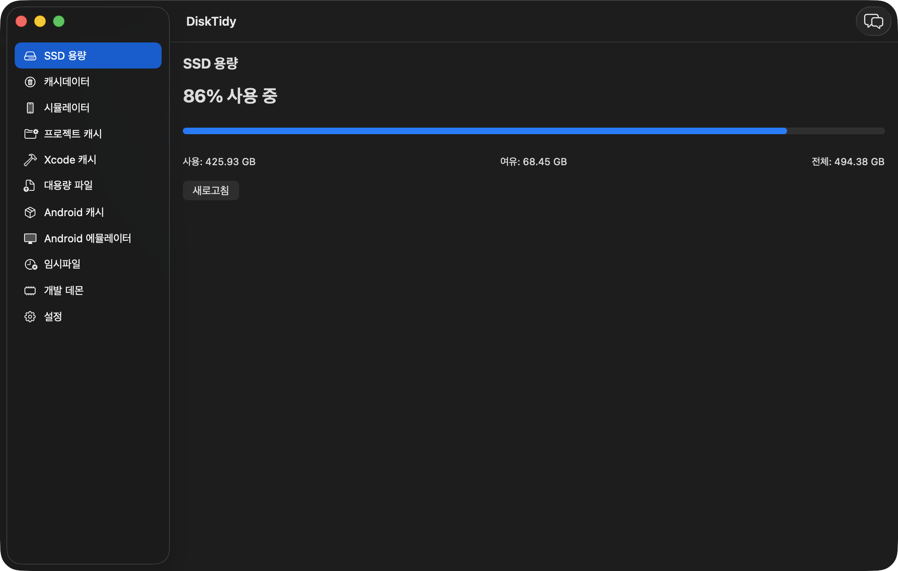

## 바로 찾기

| 알고 싶은 것 | 먼저 읽을 곳 |
|---|---|
| 어떤 화면이 있고 무엇을 보여 주나 | [1. 화면 한눈에 보기](#1-화면-한눈에-보기) |
| 설치와 첫 실행(Gatekeeper 차단) | [2. 설치](#2-설치) |
| 무엇을 후보로 올리고 무엇을 거르나 | [3. 정리 규칙](#3-정리-규칙) |
| 휴지통인가 완전 삭제인가 | [4. 삭제 정책](#4-삭제-정책) |
| AI 도우미와 밖으로 나가는 정보 | [5. AI 도우미](#5-ai-도우미) |
| 창이 다른 앱 뒤로 숨는 문제 | [6. 창 동작](#6-창-동작) |
| 소스 어디에 무엇이 있나 | [7. 소스 구조](#7-소스-구조) |
| 왜 이렇게 만들었나 | [8. 설계 메모](#8-설계-메모) |

### 1.5.4에서 달라진 것

**AI 도우미를 열면 사이드바가 눌리던 문제를 고쳤다.** 1.5.2에서 목록 상단 바가 넓어진 뒤로,
채팅 패널을 열면 부족한 폭을 `NavigationSplitView`가 **사이드바에서** 가져갔다 — 사이드바가
164pt까지 줄어 항목 이름이 왼쪽에서 잘렸다(SSD 용량 탭만 상단 바가 없어 무사했다).

- 채팅 패널이 열려 있으면 창의 최소 폭을 사이드바 200 + 본문 660 + 패널 380 = 1240으로 올린다.
  창이 한 번 넓어지는 편이 사이드바를 잃는 것보다 낫다 → [6. 창 동작](#6-창-동작)
- 사이드바 폭을 min·ideal·max로 함께 고정한다. 값 하나만 주면 압력이 걸릴 때 먼저 줄어든다.
- 상단 바가 좁은 창에서 줄어들 수 있게 했다. 검색창이 먼저 줄고, 그다음 제목이 잘린다(전체
  제목은 툴팁). 선택 요약(`59개 · 179.8 MB`)은 마지막까지 남는다 — 이 화면이 답해야 하는 첫
  질문이라서다.
- 채팅 패널 최소 폭을 380으로 올렸다. 300에서는 "새 대화" 버튼이 잘렸다.

### 1.5.3에서 달라진 것

**실행 직후 앱이 종료되는 문제를 고쳤다.** 1.5.2 이하 모든 버전이 영향을 받고, macOS 26에서
메뉴바 아이콘이 숨겨져 있으면 재현된다 — 실행하면 0.5초 만에 프로세스가 사라져 창도 메뉴바
아이콘도 보이지 않는다.

원인은 메뉴바 아이콘이었다(lldb로 종료 호출자 확인). macOS 26의 SwiftUI `MenuBarExtra`는 상태
아이콘을 FrontBoard 씬(`NSSceneStatusItem`)으로 호스팅하고 그 아이콘에는 `terminateOnRemoval`이
켜져 있다. 실행 직후 시스템이 "숨김" 액션을 보내면 AppKit은 그것을 **사용자가 아이콘을 제거한
것**으로 읽어 앱을 종료한다 (`-[NSSceneStatusItem scene:handleActions:]` →
`-[NSApplication terminate:]`). 상태 아이콘의 표시 여부는 앱 자신의 설정 도메인에 남는데
(`NSStatusItem Visible Item-N`), 이 기계에서는 전부 숨김으로 기록돼 있었다.

최소 재현으로 범위를 좁혔다: `MenuBarExtra`만 있는 앱은 죽고, `Window` 씬만 있는 앱은 산다 —
창 부재도 자동 종료도 원인이 아니다. 시스템이 왜 실행 시점에 숨김을 요청했는지는 확정하지
못했다(메뉴바가 꽉 찬 환경에서 재현됐다).

- 메뉴바 아이콘을 씬으로 호스팅되지 않는 고전 `NSStatusItem`으로 직접 만든다. 여기에는 그 종료
  경로가 아예 없다 → [6. 창 동작](#6-창-동작)
- 창을 닫아도 앱이 메뉴바에 남는다. 이전에는 마지막 창을 닫는 순간 앱이 종료돼 메뉴바 아이콘까지
  사라졌다. 종료는 메뉴바의 "종료"로 한다.
- 인앱 업데이트 뒤 자동 재실행도 같은 경로로 죽었으므로 함께 해결된다.

### 1.5.2에서 달라진 것

목록 화면 다섯 곳(캐시 계열 · 임시파일 · 시뮬레이터 · 개발 데몬)의 조작을 통째로 바꿨다. 하단 버튼이 눈에 들어오지 않는다는 피드백에서 시작했다 → [1.2](#12-목록-다루기)

- **선택은 목록 머리글에서 한다.** 3상태 체크박스(`☐` 없음 / `[-]` 일부 / `☑` 전체)가 하단의 "전체 선택 · 전체 해제" 버튼을 대신한다. 일부만 고른 상태에서 누르면 전체 해제다. 키보드는 ⌘⇧A.
- **파괴적 액션은 화면 우측 상단으로.** 휴지통으로 이동 · 완전 삭제 · 데몬 종료 · 기기 삭제는 제목 줄 오른쪽에 있고, **선택이 있을 때만 주황 배경**이 된다.
- **열 제목이 붙고 눌러서 정렬한다.** 이름 · 수정일 · 크기(시뮬레이터는 런타임·마지막 사용, 개발 데몬은 메모리)로 오름/내림 전환.
- **검색으로 걸러 본다.** 항목이 수백 개인 목록에서 이름·경로·판정 근거로 좁힌다. 걸러 봐도 이미 고른 항목의 선택은 유지되고, 머리글 체크박스는 **보이는 항목만** 건드린다.
- **삭제 진행률과 취소.** 수 GB 항목은 한 건에 몇 초씩 걸린다. `3/12`처럼 진행을 보여 주고, 취소는 아직 시작하지 않은 항목만 건너뛴다 → [4](#4-삭제-정책)
- **크기 비중 막대**로 상위 몇 개가 목록의 대부분인지 한눈에 보인다.
- 행 우클릭으로 **Finder에서 보기 · 경로 복사**(프로세스는 PID·실행 경로 복사, 시뮬레이터는 UDID 복사).
- 고친 것: 개발 데몬 탭의 전체 선택이 종료할 수 없는 프로세스까지 체크해 "선택 8개 · 종료 가능 0개"가 되던 문제, 캐시데이터 탭의 수정일이 전부 비어 있던 문제, 목록이 비었을 때 빈 사각형이 화면을 덮던 문제.

> 스크린샷은 1.5.1 화면이라 하단 버튼이 남아 있다. 다음 커밋에서 다시 찍는다.

### 1.5.1에서 달라진 것

- **개발 데몬 탭이 활동 지표를 보인다.** 프로세스마다 시작 시각 · CPU 누적 · 마지막 활동 · 띄운 앱이 붙고, 지금 일하는 중이면 초록 배지가 뜬다 → [3.5](#35-개발-데몬-활동-지표)
- 임시파일 탭을 사이드바 위쪽(SSD 용량 바로 아래)으로 올렸다. 에이전트 작업물이 tmp에 GB 단위로 쌓여 가장 자주 여는 탭이 됐다.
- `dart` 프로세스 설명을 고쳤다 — 이름이 `dart`인 것 대부분은 에이전트가 세션마다 하나씩 띄우는 Dart MCP 서버다.

---

## 1. 화면 한눈에 보기

좌측 사이드바로 이동하는 **12개 화면** + 메뉴바 상시 표시 + 오른쪽 AI 도우미 인스펙터. 탭을 다시 열면 이전 스캔 결과가 즉시 보이고, 새 스캔은 뒤에서 돌아 끝나는 대로 갱신된다.

사이드바는 고정 폭으로 항상 열려 있다. 접었다 펴는 동안 macOS가 툴바를 다시 배치하면서 오버플로 표시(»)가 한 프레임 번쩍이는데, 툴바 항목을 전부 없애도 재현된다(실측). 탭이 12개뿐이라 접어서 얻을 것도 없다.

| 화면 | 내용 |
|---|---|
| SSD 용량 | 전체/사용/여유 용량, 사용률(%) |
| 임시파일 | `/private/tmp` · `$TMPDIR`의 최상위 항목 ([안전 규칙](#34-임시파일-안전-규칙)) |
| 캐시데이터 | `~/Library/Caches/*` 앱별 캐시 |
| 시뮬레이터 | iOS 시뮬레이터 목록(기본 정렬: 마지막 사용 오름차순), 기기 삭제 · 데이터 초기화. [병렬 테스트 클론과 런타임](#33-시뮬레이터-테스트-클론과-런타임)도 여기서 정리한다 |
| 프로젝트 캐시 | 고른 폴더 하위의 빌드 캐시 재귀 탐색 ([판정 규칙](#31-프로젝트-캐시-판정-규칙)) |
| Xcode 캐시 | `DerivedData` · iOS/watchOS/tvOS DeviceSupport · Archives 전역 스캔. 외장 디스크로 심볼릭 링크한 경우도 읽는다 |
| 대용량 파일 | 고른 폴더에서 200MB 이상 파일 탐색 (기본값 `~/Downloads`) |
| Android 캐시 | Gradle 캐시/배포판, `~/.android` 캐시, Android Studio IDE 캐시 |
| Android 에뮬레이터 | `~/.android/avd`의 AVD 목록, 삭제 시 `.ini` 포인터까지 정리 |
| 개발 데몬 | 메모리·스왑 지표, 장기 실행 개발 데몬 종료. 프로세스마다 [활동 지표](#35-개발-데몬-활동-지표)를 보인다 |
| 패키지 캐시 | npm · pnpm · Bun · Yarn · CocoaPods · SwiftPM · Carthage · pip · uv · Cargo · Homebrew 전역 캐시 ([집는 경로](#32-패키지-캐시가-집는-경로)) |
| 설정 | AI 제공자 연결, 로컬 CLI 제공자 옵트인, 파일 접근 권한, 창 동작(항상 위), 개발자 문의 |

### 1.1 스크린샷

| | |
|---|---|
| **임시파일** — 안전 규칙을 통과한 항목만 올라온다<br>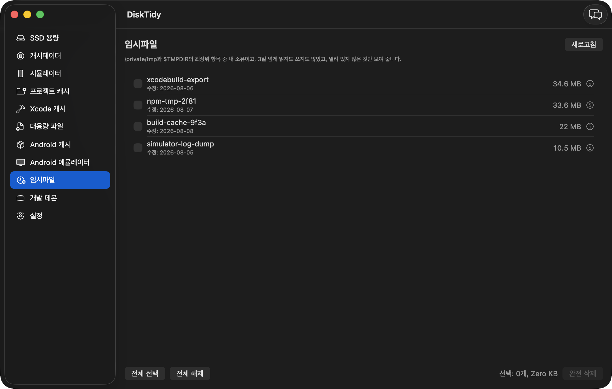 | **개발 데몬** — 시작 시각·CPU·마지막 활동·띄운 앱<br>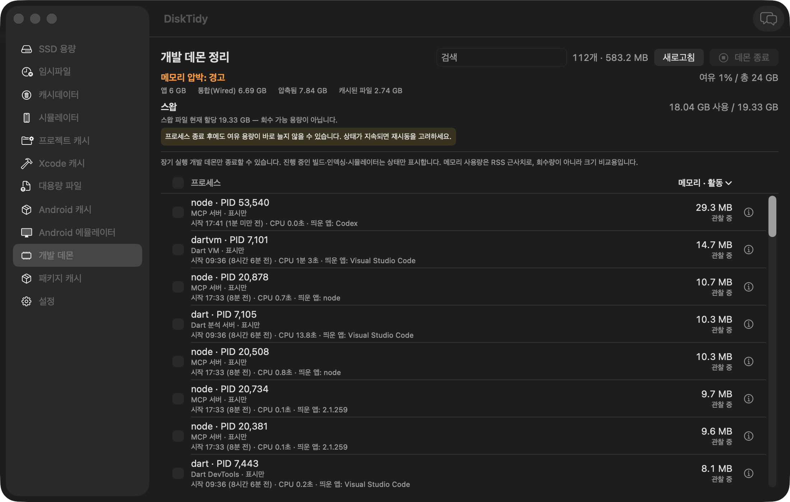 |
| **캐시데이터** — `~/Library/Caches` 앱별 캐시를 크기순으로<br>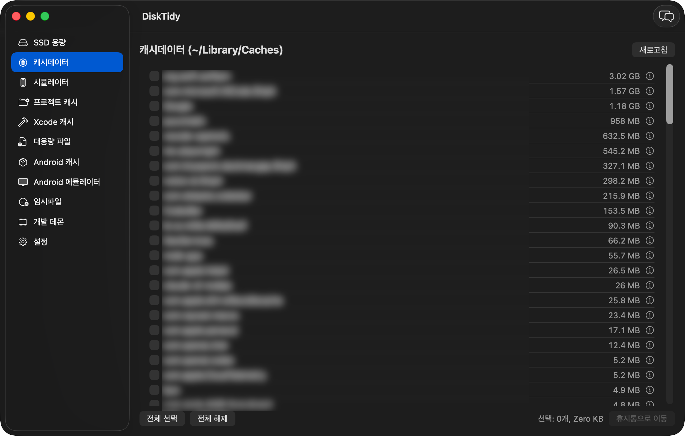 | **시뮬레이터** — 오래 방치된 기기가 위로<br>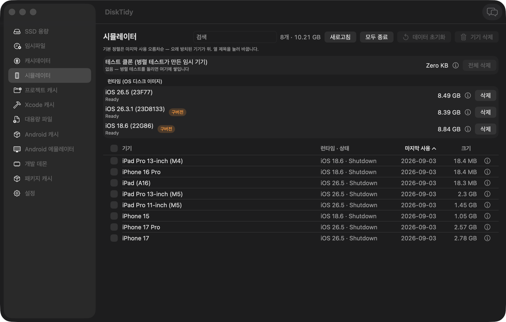 |
| **프로젝트 캐시** — 고른 폴더 하위 빌드 캐시 재귀 탐색<br>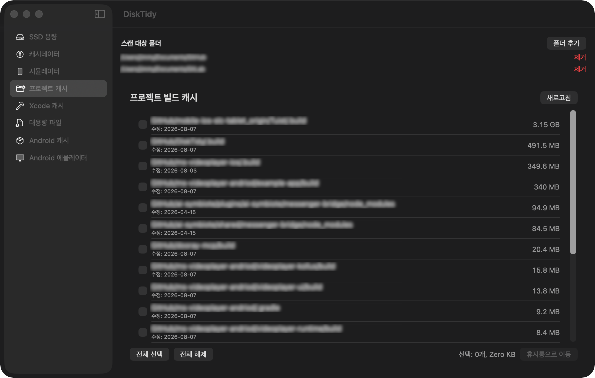 | **대용량 파일** — 200MB 이상 파일 탐색<br>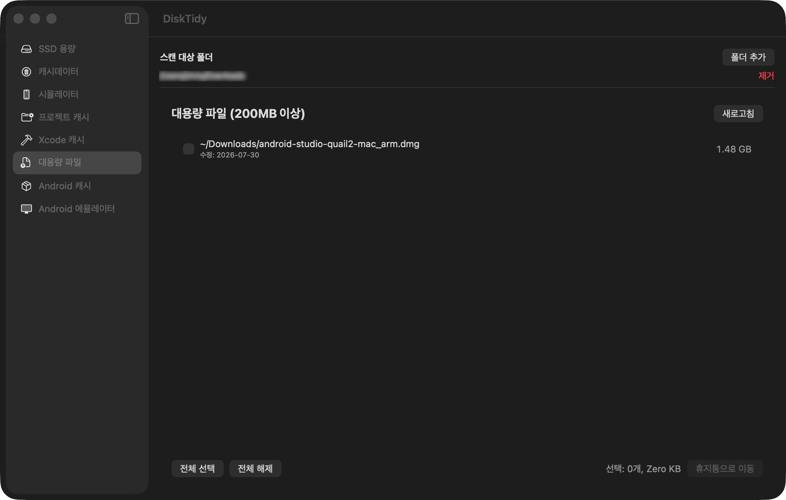 |
| **Android 캐시** — Gradle · Android Studio<br>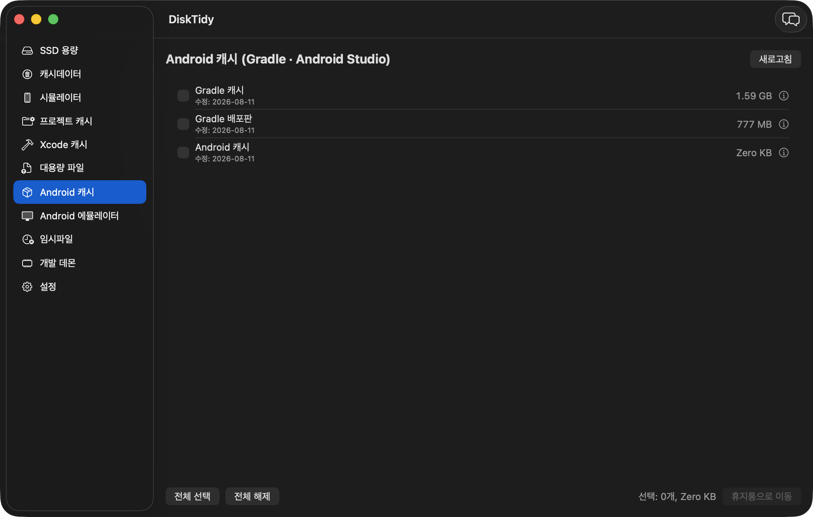 | **Android 에뮬레이터** — AVD 목록<br>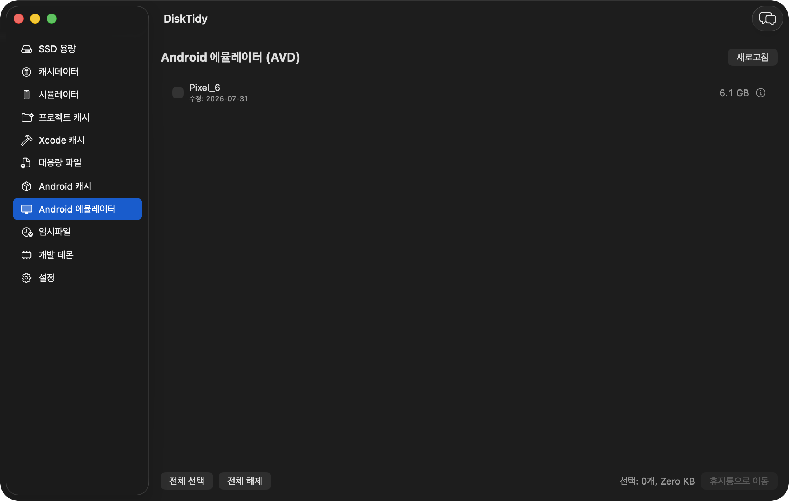 |
| **설정** — AI 제공자 연결과 창 동작<br>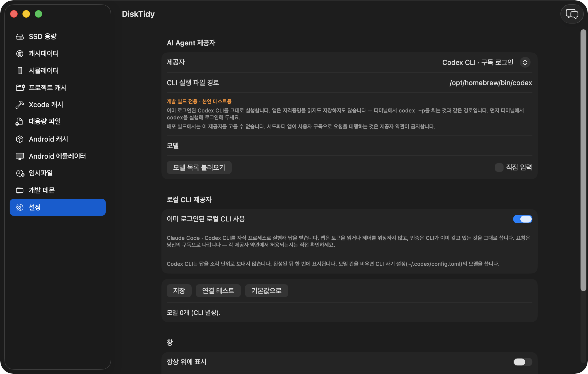 | **AI 도우미** — 오른쪽 인스펙터로 열린다<br>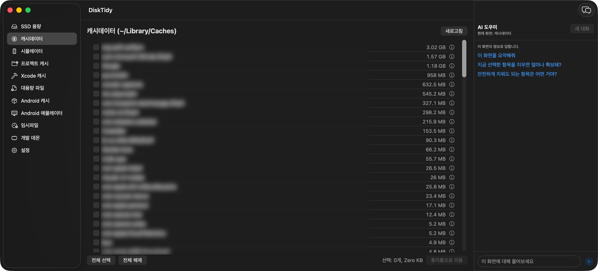 |

메뉴바 아이콘은 SSD 사용률(%)을 60초마다 갱신해 상시 표시하고, 클릭하면 게이지 + 앱 열기/종료만 뜨는 최소 드롭다운을 보여준다.

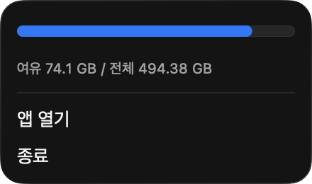

> 스크린샷은 실제 사용 화면이다. 캐시 항목명·프로젝트 경로 등 개인 정보에 해당하는 부분만 모자이크 처리했다.
> 임시파일·대용량 파일 화면은 예외다 — 촬영 시점에 조건을 만족하는 항목이 없어 조건을 통과하는 더미를 만들어 찍었다(임시파일은 내 소유 · 시간 규칙 통과 · 미개방, 대용량 파일은 200MB 이상).
> 설정 화면은 개발 빌드 전용 옵트인인 **로컬 CLI 제공자**를 켠 상태다 — 배포 빌드에서는 그 제공자가 드롭다운에 나오지 않는다.

### 1.2 목록 다루기

목록이 있는 네 화면(캐시 계열 · 임시파일 · 시뮬레이터 · 개발 데몬)은 같은 규칙으로 움직인다.

| 자리 | 무엇 |
|---|---|
| 제목 줄 오른쪽 | 검색 · 선택 요약 · 새로고침 · **액션 버튼** |
| 목록 머리글 | 3상태 전체 선택 체크박스 + 눌러서 정렬하는 열 제목 |
| 행 | 체크박스 · 이름(전체 경로는 툴팁) · 열 값 · 크기 비중 막대 · `ⓘ` 설명 버튼 |
| 행 우클릭 | Finder에서 보기 · 경로 복사 (프로세스는 PID·실행 경로, 시뮬레이터는 UDID) |

- **선택 요약**은 아무것도 고르지 않았을 때 목록 전체 규모(`125개 · 5.04 GB`)를, 고른 뒤에는 선택 합계(`선택 3개 · 1.2 GB`)를 보여 준다.
- **액션 버튼은 선택이 있을 때만 주황 배경**이다. 비활성일 때는 평범한 회색 테두리라서, 색만 보고도 지금 누를 수 있는지 알 수 있다.
- **머리글 체크박스는 3상태**다. `☐` 아무것도 없음 · `[-]` 일부만 고름 · `☑` 전부 고름. `[-]`나 `☑`에서 누르면 전체 해제다. 단축키는 ⌘⇧A(⌘A는 AI 도우미 입력창의 텍스트 전체 선택이라 비워 뒀다).
- **선택할 수 없는 행은 분모에서 뺀다.** 사용 중인 임시파일, 종료할 수 없는 프로세스는 전체 선택 대상이 아니다. 그래서 전체 선택을 눌러도 `[-]`에서 멈추지 않는다.
- **검색은 표시만 좁힌다.** 이미 고른 항목은 걸러져 보이지 않아도 선택에 남아 있고(요약의 개수로 확인된다), 머리글 체크박스는 보이는 항목만 켜고 끈다.
- **정렬은 화면에서만 한다.** 스캔 결과나 삭제 대상은 바뀌지 않는다. 기본값은 화면마다 다르다 — 크기 내림차순(캐시 계열·임시파일), 마지막 사용 오름차순(시뮬레이터), 메모리 내림차순(개발 데몬).
- 임시파일 탭은 출처별 그룹(Claude 세션 · Codex 빌드 산출물 · 에이전트 잡파일 · 그 밖)을 유지하고 **그룹 안에서만** 정렬한다. 그룹 순서는 위험도 순이라 사용자가 바꿀 값이 아니다.

---

## 2. 설치

### 2.1 요구 사항

- macOS 14 이상
- (소스 빌드 시) Xcode 26 이상 — 의존성 MarkdownView 3.0.0이 Swift tools 6.2를 요구한다. 테스트는 Swift Testing
- 첫 실행 시 macOS 파일 접근 권한(TCC) 승인 필요 — 문서·다운로드 폴더와 (스캔 경로가 있으면) 데스크탑·외장 볼륨을 실행 직후 한 번에 묻는다. **설정 탭 › 파일 접근 권한**에서 전체 디스크 접근을 켜면 폴더별로 묻지 않는다.

### 2.2 내려받아 설치 (DMG)

[Releases](../../releases)에서 `DiskTidy-<version>.dmg`를 받아 열고 `DiskTidy.app`을 `Applications`로 끌어다 놓는다.

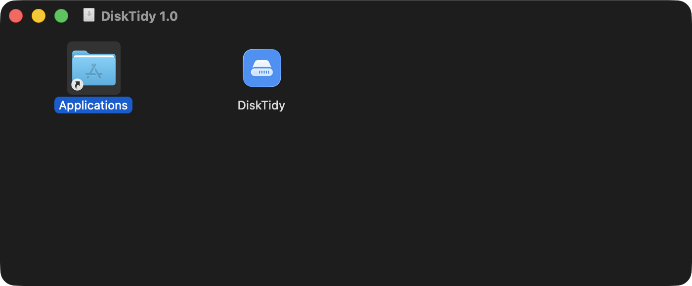

무결성 확인:

```bash
shasum -a 256 -c DiskTidy-1.5.1.dmg.sha256
```

### 2.3 첫 실행 (Gatekeeper)

이 앱은 **ad-hoc 서명(무료)이라 Apple 공증을 받지 않았다.** 처음 열면 macOS가 아래 경고를 띄우며 차단한다. 정상이다.

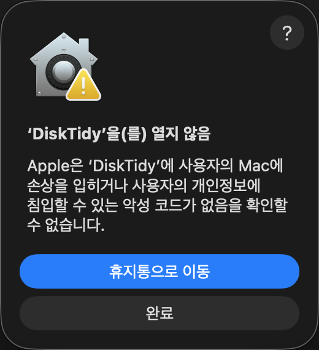

> **휴지통으로 이동을 누르지 말 것.** `완료`를 누르고 아래 절차를 따른다.

| macOS | 허용 방법 |
|---|---|
| 15 Sequoia 이상 | ① `DiskTidy.app` 한 번 실행 → 차단 경고 닫기 ② **시스템 설정 → 개인정보 보호 및 보안** ③ 아래로 스크롤해 DiskTidy의 **"확인 없이 열기"** 클릭 (Apple이 우클릭 → 열기 우회를 제거했다) |
| 14 Sonoma | `DiskTidy.app` **우클릭 → 열기** 로 한 번 실행하면 이후에는 그냥 열린다 |
| 터미널 (어느 버전이든) | `xattr -dr com.apple.quarantine /Applications/DiskTidy.app` |

서명을 신뢰하기 전에 직접 확인하려면:

```bash
codesign -dv --verbose=4 /Applications/DiskTidy.app
```

빌드마다 ad-hoc 서명이 새로 생성되므로, 재설치 후 macOS가 폴더 접근 권한(TCC)을 다시 물어볼 수 있다. 전체 디스크 접근은 다시 묻지 않고 조용히 풀리므로, 업데이트 뒤 목록이 비면 **설정 탭 › 파일 접근 권한**에서 상태를 확인하고 시스템 설정에서 다시 켠다.

### 2.4 소스에서 빌드

```bash
./Scripts/run.sh          # 개발 모드 (release 빌드 후 즉시 실행, Dock 아이콘 뜸)
swift test                # 테스트

./Scripts/build-app.sh    # release 빌드 → DiskTidy.app → /Applications 설치
./Scripts/make-dmg.sh     # release 빌드 → dist/DiskTidy-<version>.dmg + .sha256
./Scripts/make-app.sh     # DiskTidy.app 번들만 (설치·배포 안 함)
./Scripts/generate-icon.sh  # 앱 아이콘 재생성
```

`Info.plist`의 `LSUIElement=true` 때문에 설치된 `.app`은 Dock 아이콘 없이 메뉴바로만 상주한다 (개발 모드 `run.sh`는 영향 없음).

아이콘 파이프라인은 `Scripts/generate-icon.swift`(AppKit으로 SF Symbol 기반 1024px PNG 렌더링) → `sips`로 각 해상도 생성 → `iconutil`로 `Resources/AppIcon.icns` 패킹까지 한 번에 처리한다. 디자인을 바꾸려면 `generate-icon.swift`의 배경색·SF Symbol 이름을 수정한 뒤 다시 실행한다.

> **포크한다면** `Info.plist`의 `CFBundleIdentifier`(`com.jimmy.disktidy`)와 `TrashService`·`PermanentDeleter`·`TempCleanupViewModel`의 로거 subsystem을 본인 것으로 바꿀 것. 공증까지 하려면 Apple Developer Program($99/년) 가입 후 `codesign --options runtime --sign "Developer ID Application: ..."` + `xcrun notarytool submit`이 필요하다.

---

## 3. 정리 규칙

### 3.1 프로젝트 캐시 판정 규칙

이름만으로 캐시라 단정할 수 있는 디렉터리와, 마커 파일 확인이 필요한 디렉터리를 구분한다.

| 구분 | 디렉터리 | 조건 |
|---|---|---|
| 이름으로 판정 | `Pods` `DerivedData` `.gradle` `Carthage` `.dart_tool` `.next` `.expo` | 없음 |
| 마커 필요 | `node_modules` `dist` | 부모에 `package.json` |
| 마커 필요 | `target` | 부모에 `Cargo.toml` `pom.xml` `build.gradle` `build.gradle.kts` 중 하나 |
| 마커 필요 | `build` | 부모에 `package.json` `build.gradle` `build.gradle.kts` `CMakeLists.txt` `pom.xml` 중 하나 |
| 마커 필요 | `.build` | 부모에 `Package.swift` |

`build` · `dist` · `target`은 커밋된 소스 디렉터리일 수 있어서 마커 없이는 건드리지 않는다. 스캔 루트로 `/` `~` `/Users` 등 지나치게 넓은 경로는 선택할 수 없다.

### 3.2 패키지 캐시가 집는 경로

프로젝트 캐시 탭은 프로젝트 **안**(`node_modules` · `Pods`)만 본다. 정작 몇 GB씩 자라는 것은 홈에 있는 전역 캐시인데 어느 탭도 보여 주지 않아서 별도 탭으로 모았다. Gradle 계열은 Android 캐시 탭 담당이라 여기서 뺐다.

| 도구 | 경로 |
|---|---|
| npm | `~/.npm/_cacache` |
| pnpm | `~/Library/pnpm/store` |
| Bun | `~/.bun/install/cache` |
| Yarn | `~/Library/Caches/Yarn` |
| CocoaPods | `~/.cocoapods/repos` · `~/Library/Caches/CocoaPods` |
| SwiftPM | `~/Library/Caches/org.swift.swiftpm` |
| Carthage | `~/Library/Caches/org.carthage.CarthageKit` |
| pip | `~/Library/Caches/pip` |
| uv | `~/Library/Caches/uv` |
| Cargo | `~/.cargo/registry` |
| Homebrew | `~/Library/Caches/Homebrew` |

**도구 루트가 아니라 캐시 하위 경로만 집는다.** `~/.cargo`에는 `credentials.toml`이, `~/.cocoapods`에는 설정이 함께 있어서 루트째 지우면 재생성되지 않는 것까지 날아간다. 목록에 올린 경로는 전부 "지우면 다음 설치에서 다시 내려받는" 부류만 남겼다. 존재하지 않는 경로는 목록에 아예 뜨지 않는다.

### 3.3 시뮬레이터 테스트 클론과 런타임

기기 목록 위에 두 가지를 더 보여 준다. 둘 다 `simctl`을 거치므로 되돌릴 수 없고, 실행 전 확인 다이얼로그를 띄운다.

- **테스트 클론 (`~/Library/Developer/XCTestDevices`)** — Xcode가 병렬 테스트마다 만드는 시뮬레이터 복제본이다. 테스트가 끝나도 자동으로 지워지지 않아 수백 GB까지 쌓인다. 이름이 전부 UUID라 목록 대신 개수·합계·마지막 사용일만 요약하고 `simctl --set testing delete all`로 일괄 삭제한다. 다음 병렬 테스트에서 필요한 만큼 다시 만들어진다. 크기는 `--set testing` 목록이 아니라 **디스크를 직접 세서** 구한다 — 런타임이 지워진 고아 클론은 그 목록에서 빠지지만 디스크는 그대로 차지하고 있다.
- **런타임 (OS 디스크 이미지)** — `simctl runtime list`로 읽어 플랫폼별로 묶고 최신 버전을 위에 둔다. 같은 플랫폼에 더 새 버전이 있으면 **구버전** 배지를 달아 삭제 우선순위를 표시한다. 버전 비교는 문자열이 아니라 숫자 기준이다(`26.3.1` < `26.5`). 삭제는 `simctl`이 백그라운드로 처리해서, 성공한 뒤에도 목록에 `Deleting` 상태로 한동안 남는 것이 정상이다. 지운 런타임은 Xcode 설정 → Components에서 다시 받을 수 있다.

### 3.4 임시파일 안전 규칙

`/tmp`은 공용 디렉터리다. 최상위에 유닉스 소켓·타 사용자 소유 파일·아직 쓰이는 마커가 섞여 있어서, 항목 하나를 후보로 올리려면 아래 5개를 **모두** 통과해야 한다. 하나라도 판정할 수 없으면 후보에서 뺀다.

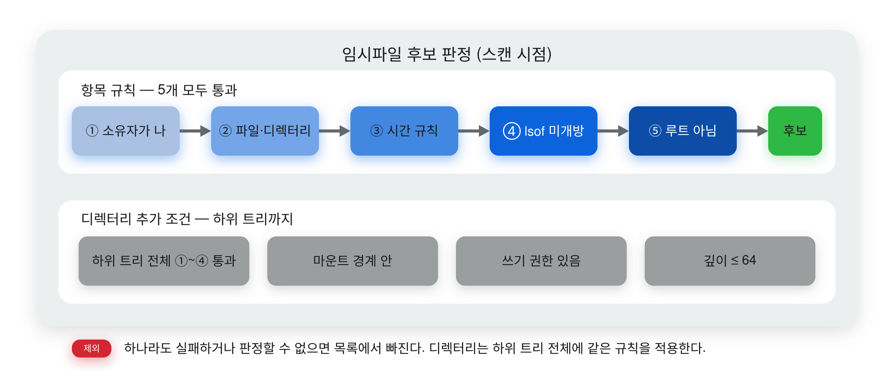

| # | 규칙 |
|---|---|
| 1 | 소유자가 나 (`st_uid == getuid()`) |
| 2 | 정규 파일 또는 디렉터리 — 소켓·FIFO·심볼릭 링크 제외 |
| 3 | 출처별 시간 규칙 — **Claude 세션 스크래치 · Codex 빌드 산출물 · 에이전트 잡파일**은 세션이 끝났거나(살아 있는 Claude 프로세스의 세션 기록·트랜스크립트 갱신·같은 프로젝트의 재개 가능성 세 신호로 판정) 빌드 프로세스가 없고 `mtime`이 30분 초과 · **그 밖**은 `atime`과 `mtime`이 둘 다 24시간 초과 |
| 4 | `lsof` 스냅샷에 열린 경로로 잡히지 않음 |
| 5 | 루트 디렉터리 자체가 아님 |

디렉터리는 자신뿐 아니라 **하위 트리 전체**가 규칙 1~4를 통과해야 한다. 안에 소켓 하나, 열린 파일 하나만 있어도 디렉터리째 후보에서 빠진다.

**에이전트 작업물은 후보 단위와 시간 규칙이 다르다.** `/private/tmp/claude-<uid>`는 통째로 잡지 않고 `<프로젝트>/<세션 UUID>` 디렉터리 단위로 내려간다 — 통째로 잡으면 지금 돌고 있는 세션의 작업 파일까지 날린다. 살아 있는 세션·빌드가 참조 중인 DerivedData는 목록에 회색 비활성 행으로 보이고 선택할 수 없다. 이유는 [`docs/temp-cleanup.md`](docs/temp-cleanup.md) 3-A절.

여기에 세 가지를 더 막는다.

- **마운트 경계를 넘지 않는다.** 후보와 하위 항목의 `st_dev`가 루트와 같아야 한다. 마운트 포인트를 품은 디렉터리는 이동이 성공하므로, 막지 않으면 재귀 삭제가 마운트된 볼륨 내용까지 지운다.
- **쓰기 권한 없는 디렉터리는 후보가 아니다.** `0555` 디렉터리는 열거만 되고 자식 삭제는 실패한다. 삭제는 원자적이지 않아 일부만 지운 채 멈추고, 그 시점에 복원까지 막힌다.
- **하위 트리 깊이 상한은 64.** 넘으면 판정 불가로 보고 제외한다.

#### 관측 한계

- **`lsof`는 root·다른 사용자 프로세스의 파일 핸들을 완전하게 보지 못한다.** 그 프로세스가 붙잡고 있는 파일은 "열려 있지 않음"으로 보일 수 있다.
- **`atime`은 최근 읽기를 증명하지 못한다.** 파일시스템의 갱신 정책에 따라 갱신되지 않을 수 있어서, 사용 중 증명으로 취급하지 않고 보조 조건으로만 쓴다.
- 즉 이 기능은 **사용자 공간에서 관찰 가능한 상태만 보수적으로** 거른다. 위협 모델에 같은 UID의 적대 프로세스는 포함하지 않는다.
- **App Sandbox / Mac App Store 배포는 지원하지 않는다.** entitlement 없는 직접 배포 앱을 전제로 `/private/tmp`에 접근한다.
- `lsof` 실행이나 루트 열거에 실패하면 빈 목록이 아니라 **오류**로 처리한다. 목록을 비우고 경고 배너를 띄워서, 검증되지 않은 항목에 삭제 버튼이 열리지 않게 한다.

### 3.5 개발 데몬 활동 지표

*(1.5.1 신규)* "이 데몬 지금 쓰는 건가, 마지막으로 언제 일했나"를 목록에 보인다. macOS에 "마지막 사용" 같은 값은 없어서 앱이 **관찰해서** 만든다.

| 지표 | 어디서 읽나 | 무엇을 알려 주나 |
|---|---|---|
| 시작 시각 · 실행 기간 | `ps`의 프로세스 시작 시각 | 며칠째 떠 있는 데몬인지 |
| CPU 누적(초) | `proc_pidinfo(PROC_PIDTASKINFO)` (mach 단위 → timebase 환산) | 지금까지 실제로 얼마나 일했나 |
| 디스크 I/O 누적 | `proc_pid_rusage(RUSAGE_INFO_V4)` | CPU를 안 써도 파일을 쓰고 있나 |
| 실행 중 스레드 | `pti_numrunning` | 첫 관찰에서 유일한 판단 근거 |
| 띄운 앱 | 부모 PID → 실행 경로의 첫 `.app` 이름 | 누가 띄웠나 (Xcode · Visual Studio Code · Claude Code …) |

목록의 배지는 네 가지다.

| 배지 | 뜻 |
|---|---|
| **활동 중** (초록) | 직전 관찰 대비 CPU가 관찰 간격의 2% 이상(20초에 0.4초), 또는 디스크 1MB 이상, 또는 실행 중 스레드가 있음 |
| **유휴 N분 / N시간** | 위 조건이 마지막으로 참이었던 시각부터 흐른 시간 |
| **관찰 중** | 이 탭을 연 지 1분이 안 돼 아직 판정할 표본이 부족함 |
| **관찰 N 동안 활동 없음** | 관찰하는 내내 한 번도 활동이 없었음 |

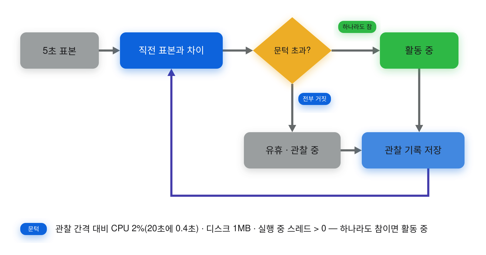

- **CPU 2% 아래는 활동으로 치지 않는다.** 유휴 JVM도 GC·JIT 정리로 관찰 간격당 수십 ms를 쓴다(실측). 이 문턱이 없으면 전부 "활동 중"이 된다.
- **관찰 기반이라 탭을 열어 둔 동안만 쌓인다.** 표본은 5초마다, 목록은 20초마다 갱신하고, 목록이 다시 읽혀도 같은 프로세스(PID + 시작 시각)면 기록을 이어 간다.
- `ps`의 상태 문자 `I`(20초 이상 유휴)는 **쓰지 않는다.** 실측으로 3시간 유휴 데몬도 전부 `S`였다.
- 표본을 뜰 때는 `ps`를 다시 돌리지 않고 목록에 있는 pid에 syscall만 한다. PID 재사용에 대비해 표본 전에 시작 시각을 다시 비교한다.

자세한 설계와 실측 기록은 [`docs/memory-cleanup.md`](docs/memory-cleanup.md).

---

## 4. 삭제 정책

| 대상 | 방식 | 되돌리기 |
|---|---|---|
| 캐시데이터 · 프로젝트 캐시 · Xcode 캐시 · 대용량 파일 · Android 캐시 · Android 에뮬레이터 · 패키지 캐시 | 휴지통으로 이동 (`FileManager.trashItem`) | 가능 |
| 시뮬레이터 기기 삭제/초기화 | `xcrun simctl delete` / `erase` | 불가 — 확인 다이얼로그 |
| 시뮬레이터 테스트 클론 · 런타임 | `simctl --set testing delete all` / `simctl runtime delete` | 불가 — 확인 다이얼로그 |
| 임시파일 | **완전 삭제** | 불가 — 확인 다이얼로그 |
| 개발 데몬 | `SIGTERM` → `SIGKILL` | 불가 — 도구가 다시 띄울 수 있음 |

**임시파일만 휴지통을 거치지 않는다.** 휴지통에 넣으면 사용자가 비우기 전까지 디스크 블록이 회수되지 않아서 tmp 탭에는 맞지 않는다. 대신 삭제 절차를 이렇게 잡았다.

1. 스캔 시점의 `st_dev + st_ino + uid + mode + mtime + atime`을 보존한다.
2. 삭제 직전 부모 디렉터리 FD 기준으로 같은 파일인지 다시 확인한다.
3. 같은 볼륨 안의 전용 격리 디렉터리로 `renameatx_np(RENAME_EXCL)` 원자 이동한다.
4. 격리 위치에서 동일성이 유지될 때만 지운다.

도중에 앱이 죽으면 격리 항목이 다음 실행의 **복구 대기 목록**에 뜨고, 자동으로 지우지 않는다.

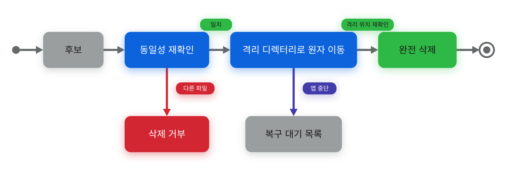

- 삭제 성공은 "경로를 삭제했다"는 뜻이다. APFS 스냅샷이나 열린 파일 때문에 여유 용량 증가가 지연될 수 있어서, 화면은 삭제한 경로 수와 새로 읽은 여유 용량을 **따로** 보여 주고 회수량을 약속하지 않는다.
- 삭제 실패(권한 부족, 사용 중인 파일, 부팅 중인 시뮬레이터)는 화면에 경고 배너로 보고하고 목록에서 지우지 않는다. 상세 원인은 Console.app에서 `com.jimmy.disktidy` 로그로 확인한다.

**진행률과 취소** *(1.5.2 신규)* — 삭제는 항목을 하나씩 처리하며 `3/12`로 진행을 보인다. 취소 버튼은 **아직 시작하지 않은 항목만 건너뛴다.**

| 화면 | 취소했을 때 이미 처리된 항목 |
|---|---|
| 캐시 계열(휴지통으로 이동) | 휴지통에 그대로 있다 — 사용자가 되돌릴 수 있다 |
| 임시파일(완전 삭제) | 돌아오지 않는다 — 취소는 남은 항목만 지킨다 |

한 항목의 처리(휴지통 이동, 격리+삭제)는 쪼개지 않는다. 취소는 항목 **사이**에서만 본다 — 절반 지운 디렉터리를 남기지 않기 위해서다. 삭제가 끝나면 몇 개를 건너뛰었는지 배너·요약에 적는다.

---

## 5. AI 도우미

툴바의 말풍선 버튼이나 **보기 → 인스펙터 보기(⌃⌘I)** 로 오른쪽 인스펙터를 연다. macOS 표준 인스펙터라 여닫는 애니메이션과 경계 드래그, 폭 저장을 시스템이 처리한다.

**지금 보고 있는 탭의 화면 정보를 근거로** 대화한다 — 항목 수와 합계, 선택 상태, 목록 상위 40개, 스캔 상태, 오류 배너, 그 화면의 삭제 방식이 매 질문마다 새로 만들어져 프롬프트에 실린다. 스캔이 끝난 뒤 물어도 최신 목록으로 답하도록 값이 아니라 스냅샷 함수를 등록하는 구조다.

**챗봇은 앱을 조작할 수 없다.** 도구 호출을 붙이지 않았다. 삭제·초기화·프로세스 종료는 전부 사용자가 직접 버튼을 눌러야 하고, 확인 다이얼로그도 그대로 거친다.

### 5.1 제공자 연결

| 제공자 | 기본 루트 | 형식 |
|---|---|---|
| Anthropic (Claude) | `https://api.anthropic.com` | Messages API |
| OpenAI | `https://api.openai.com` | Chat Completions |
| OpenAI 호환 (직접 입력) | 사용자가 입력 | Chat Completions |

버전 경로(`/v1/messages`, `/v1/chat/completions`)는 앱이 붙인다. 루트만 넣으면 되고 `/v1`이나 문서에서 복사한 전체 엔드포인트 경로를 붙여도 흡수한다. HTTP 요청은 60초에서 끊는다.

**로컬 모델은 OpenAI 호환으로 붙인다.** 전용 Ollama 제공자를 두었다가 걷어냈다 — 8B 모델 하나에 메모리 18GB, 모델 캐시 17GB를 먹어서 디스크 정리 유틸리티가 요구할 자원이 아니었다. 대신 **OpenAI 호환 (직접 입력)** 에 `http://localhost:<포트>`를 넣으면 LM Studio · llama.cpp · Ollama 서버가 그대로 붙는다. 어느 것을 띄울지는 사용자가 정한다.

**모델은 드롭다운에서 고른다.** 설정 화면이 열릴 때 `GET /v1/models`로 목록을 받아 온다(두 와이어 포맷이 같은 응답 형식을 쓴다). 임베딩·음성·이미지·모더레이션 모델은 골라 봐야 실패하므로 목록에서 뺀다. 사내 게이트웨이나 프리뷰 모델처럼 목록에 없는 이름을 써야 하면 **직접 입력**을 켠다. 목록 조회는 모델 이름을 요구하지 않는다 — 이름을 몰라서 쓰는 기능이기 때문이다.

**기본은 API 키다.** 앱이 구독 자격증명을 대행하는 방식은 넣지 않았다. Anthropic은 서드파티 앱이 claude.ai 로그인을 제공하거나 Free/Pro/Max 자격증명으로 요청을 대행하는 것을 [명시적으로 금지](https://code.claude.com/docs/en/legal-and-compliance)하고 사전 통보 없이 차단할 수 있다고 밝히고 있으며, ChatGPT 구독도 API 사용량을 포함하지 않는다(별도 과금). 키 없이 쓰려면 아래 로컬 CLI 경로를 직접 켠다.

### 5.2 항목 설명 버튼 (ⓘ)

목록 각 줄의 ⓘ 버튼을 누르면 그 항목이 무엇이고 지워도 되는지 팝오버로 설명한다.

**앱이 스스로 아는 항목은 AI에게 묻지 않는다** — 목록에 들어온 경로 대부분은 앱이 찾아서 넣은 것이라(예: `~/.gradle/caches`) 정체를 모델에게 되묻는 것은 느리고 비싸고 덜 정확하다. `KnownItemCatalog`에 적힌 항목(DerivedData · Archives · DeviceSupport · Gradle 캐시 등)은 AI 연결 없이도 즉시 뜨고, 대용량 파일·임시파일 탭의 낯선 경로와 처음 보는 프로세스만 AI에게 넘긴다. 받은 답은 캐시되어 같은 항목을 다시 눌러도 재요청하지 않는다.

### 5.3 로컬 CLI 제공자 (옵트인)

설정 → **로컬 CLI 제공자**를 켜면 제공자 목록에 두 개가 추가된다. 기본은 꺼져 있고, 켤 때 확인을 한 번 받는다.

- **Claude Code CLI · 구독 로그인**
- **Codex CLI · 구독 로그인**

이미 로그인된 공식 CLI를 자식 프로세스로 실행하고 그 출력을 답변으로 쓴다.

```
claude -p <대화 전문> --model sonnet \
       --output-format stream-json --include-partial-messages --verbose \
       --append-system-prompt <화면 스냅샷 포함 시스템 프롬프트> \
       --disallowed-tools Bash Edit Write NotebookEdit WebFetch WebSearch Task Read Glob Grep \
       --strict-mcp-config

codex exec --json --sandbox read-only --skip-git-repo-check --ephemeral \
       <규칙 + 화면 스냅샷 + 대화 전문>
```

**하지 않는 것**이 중요하다. 구독 OAuth 토큰을 읽지 않고, 헤더를 위장하지도 않는다. 그 방식은 제공자가 서버에서 차단하고 계정 정지 사유다. 여기서는 사용자가 터미널에서 직접 치는 명령을 같은 자격증명으로 실행할 뿐이며, 앱은 자격증명을 보지도 저장하지도 않는다.

그래도 **요청은 당신의 구독으로 나간다.** 각 제공자 약관에서 허용되는지는 직접 확인해야 한다 — 그래서 기본으로 숨기고 켤 때 확인을 받는다. App Store 배포에는 쓸 수 없다(샌드박스가 외부 실행 파일 실행을 막는다). DMG 직접 배포에서만 동작한다.

경계:

- **Claude Code는 도구를 전부 막는다.** 화면 스냅샷을 이미 프롬프트에 담아 넘기므로 도구가 필요 없고, 열어 두면 이 앱이 사용자 파일을 고치거나 명령을 실행하는 경로가 된다. `--strict-mcp-config`로 전역 MCP 서버도 끌어오지 않는다.
- **Codex는 읽기 전용 샌드박스**(`--sandbox read-only`)로 돌린다. Codex에는 도구를 통째로 끄는 스위치가 없어서, 모델이 명령을 실행해도 쓰기를 막는 쪽으로 경계를 세운다. `--ephemeral`로 세션 파일도 남기지 않는다.
- **작업 디렉터리는 `$TMPDIR`.** 실수로 파일을 건드려도 저장소가 아니다.
- **180초 타임아웃.** 로그인이 만료된 CLI에 영구히 매달리지 않는다.

**스트리밍은 도구마다 다르다.** Claude Code는 조각 단위로 흘려 받아 실시간으로 써진다(`--include-partial-messages`가 없으면 블록 완성본만 와서 한 덩어리가 된다). Codex는 `codex exec --json`에 델타 옵션이 없어 완성된 답변이 한 번에 온다 — 그동안 답변 자리에 진행 표시가 뜬다.

**모델**: Claude Code는 CLI 별칭(`sonnet`·`opus`·`haiku`)을 쓴다. Codex는 모델 칸을 **비워 두면** CLI 자기 설정(`~/.codex/config.toml`)의 모델을 쓴다 — 유효한 이름이 계정 종류와 CLI 버전에 따라 달라서 앱이 고르지 않는다.

**실행 파일 경로**: 터미널에서 CLI에 한 번 로그인한 뒤 `which claude`(또는 `which codex`) 결과를 설정의 **CLI 실행 파일 경로**에 넣는다. 기본값은 흔한 설치 위치와 nvm 버전 디렉터리를 훑어 채운다 — GUI로 실행된 앱의 `PATH`에는 `/usr/bin:/bin` 정도만 있어서 이름만으로는 찾지 못한다. npm으로 깐 CLI는 `#!/usr/bin/env node` 셰방이라 `node`도 찾아야 하므로, 자식 프로세스의 `PATH` 맨 앞에 **실행 파일이 있는 디렉터리**를 넣어 준다.

### 5.4 밖으로 나가는 정보

- **보내지는 것** — 질문할 때마다 그 화면의 **항목 이름·경로·용량·선택 상태**가 선택한 제공자의 서버로 전송된다. 파일 내용은 보내지 않는다. 기기 밖으로 내보내고 싶지 않으면 **OpenAI 호환 (직접 입력)** 에 로컬 서버 주소(`http://localhost:…`)를 넣는다.
- **키 저장** — API 키는 macOS 키체인(`com.jimmy.disktidy.ai`)에 제공자별로 저장한다. `UserDefaults`에는 제공자·루트 URL·모델만 남는다. ad-hoc 서명 빌드는 빌드마다 서명 identity가 바뀌어 키체인 접근 권한을 다시 묻는다.
- **평문 HTTP** — 원격 평문 `http`로는 요청을 보내지 않는다(키 노출). `http`는 루프백(`localhost` · `127.0.0.1` · `::1`)에만 허용한다.

### 5.5 답변 렌더링

답변은 [MarkdownView](https://github.com/LiYanan2004/MarkdownView)로 그린다 — 스트리밍 증분 파싱과 블록을 넘는 텍스트 선택이 필요해서다. 기본값에서 둘을 바꿨다.

- **원격 이미지는 요청 자체를 만들지 않는다** — 화면 스냅샷에 든 파일 경로가 모델을 유도해 ``를 출력시키면 답변이 그려지는 순간 경로가 밖으로 새기 때문이다.
- **구문 강조·수식 렌더는 끈다** — 라이브러리 기본 스타일이 `Bundle.module`로 리소스를 찾는데, ad-hoc 서명 앱에서는 그 번들을 `.app` 루트에 넣으면 서명이 깨지고 빼면 다른 머신에서 `fatalError`가 난다(실측).

사용자가 입력한 메시지는 원문 그대로 둔다 — 직접 적은 `*`가 서식으로 먹히면 원문이 바뀐 것처럼 보인다. 답변은 1024 토큰에서 끊고, 상한에 걸려 잘리면 끝에 `(답변이 길이 제한으로 잘렸습니다.)`를 붙인다 — 잘린 답변을 완결된 답변으로 읽으면 안 되기 때문이다.

---

## 6. 창 동작

Dock 아이콘이 없는 앱(`LSUIElement`)이라 창이 다른 앱 뒤로 숨으면 다시 찾을 방법이 없다. 그래서 창을 띄울 때 활성화·전면 배치·Space 이동을 함께 처리하고, 기본값으로 **항상 위에 표시**를 켠다. 설정 탭 → 창에서 끌 수 있다.

활성화만으로는 부족하다는 것을 실측으로 확인했다. 다른 앱이 전체 화면이면 그 앱이 Space를 차지하고 창은 다른 Space에 남는다 — `lsappinfo`는 DiskTidy가 최전면이라고 답하고 `CGWindowList`에도 창이 화면 좌표 안에 있다고 나오는데, 스크린샷에는 전체 화면 편집기만 찍힌다. 그래서 창 레벨을 `.floating`으로 올리고 `canJoinAllSpaces` · `fullScreenAuxiliary`를 함께 준다(항상 위 끄면 `.normal` + `moveToActiveSpace`). 실행 직후에는 SwiftUI가 아직 창을 만들지 않았을 수 있어, 창이 생길 때까지 짧은 간격으로 몇 번 더 시도한다.

**AI 도우미를 열면 창이 최소 1240pt로 넓어진다** *(1.5.4)*. 사이드바 200 + 본문 660 + 패널 380이다. 이 폭을 확보하지 않으면 `NavigationSplitView`가 부족한 폭을 사이드바에서 가져가고, 사이드바는 `min·ideal·max`를 같은 값으로 고정해도 눌린다(실측 164pt까지). 창이 한 번 넓어지는 편이 사이드바를 잃는 것보다 낫다고 보고 최소 폭을 올렸다.

**창을 닫아도 앱은 메뉴바에 남는다** *(1.5.3)*. 기본 동작대로 두면 SwiftUI가 마지막 창이 닫힐 때 앱을 종료하는데, Dock 아이콘이 없는 앱이라 종료되면 메뉴바 아이콘까지 사라져 다시 열 방법이 없다. 종료는 메뉴바의 "종료"로만 한다.

**메뉴바 아이콘은 SwiftUI `MenuBarExtra`가 아니라 AppKit `NSStatusItem`이다** *(1.5.3)*. `MenuBarExtra`가 만드는 상태 아이콘은 FrontBoard 씬으로 호스팅되고 "제거되면 앱 종료"(`terminateOnRemoval`)가 켜져 있어서, 시스템이 숨김을 요청하는 순간 앱이 종료된다 — 1.5.2 이하에서 앱이 실행되지 않던 원인이다. 고전 `NSStatusItem`을 직접 만들면 그 경로가 없다. `behavior = []`는 새 아이콘의 기본값과 같지만, 나중에 제거 허용이 붙으면 같은 버그가 되살아나므로 코드와 테스트로 못 박아 둔다.

---

## 7. 소스 구조

```
DiskTidy/
  Package.swift
  Info.plist
  LICENSE                  # MIT
  README.md / README.en.md
  CONTRIBUTING.md
  .github/workflows/
    ci.yml                 # 빌드 + 테스트 + 경고 0건 검사
    release.yml            # v* 태그 push 시 DMG 빌드 + 릴리스 첨부
  docs/
    screenshots/           # README용 스크린샷
    diagrams/              # README용 SVG 다이어그램 (한글 · `.en` 영문, 라이트·다크 대응)
    memory-cleanup.md      # 개발 데몬 탭 설계 (프로세스 판정 · 활동 지표)
    temp-cleanup.md        # 임시파일 탭 설계 (안전 규칙 · 격리 삭제)
  Resources/
    AppIcon-1024.png       # 아이콘 소스 PNG
    AppIcon.icns           # 앱에 실제 포함되는 아이콘
    AppIcon.iconset/       # 중간 산출물 (git 제외, generate-icon.sh가 재생성)
  Scripts/
    run.sh                 # 개발 모드 실행
    make-app.sh            # DiskTidy.app 번들 생성 (아래 둘이 공유)
    build-app.sh           # make-app.sh + /Applications 설치
    make-dmg.sh            # make-app.sh + dist/DiskTidy-<version>.dmg + .sha256
    generate-icon.sh       # 아이콘 전체 파이프라인
    generate-icon.swift    # 아이콘 PNG 렌더러
  dist/                    # DMG 산출물 (git 제외)
  Sources/DiskTidy/
    DiskTidyApp.swift      # @main, WindowGroup + MenuBarExtra
    Models/                # CleanableItem, TempCandidate, SimulatorItem, StorageSnapshot,
                           #   RunningProcess(+ProcessUsage·ProcessActivity),
                           #   AppNavigationState + AI(AIProvider, AIChatMessage,
                           #   ScreenContext, ChatContextStore, KnownItemCatalog)
    Services/              # 스캐너 + 공용 헬퍼(ShellRunner, DiskScanner, TrashService,
                           #   RootFolderStore, FileAttributes, StorageInfo, StorageMonitor,
                           #   DirectoryContents)
                           #   + 임시파일 전용(TempRootPolicy, TempScanner, PermanentDeleter)
                           #   + 프로세스(ProcessScanner, ProcessTerminator)
                           #   + AI(APIKeyStore, SettingsStore, AIRequestBuilder,
                           #   AIStreamParser, AIChatClient, AIModelCatalog, AIChatError,
                           #   AICLIClient, AICLIStreamParser)
    ViewModels/            # CleanableListViewModel(전 캐시 탭 공용), SimulatorViewModel,
                           #   RootFolderViewModel, TempCleanupViewModel, MemoryViewModel,
                           #   AISettingsViewModel, ChatViewModel, ScreenContextBuilder,
                           #   ItemExplanationStore
    Views/                 # ContentView(고정 사이드바 + AI 인스펙터 토글) + 화면별 탭 뷰 +
                           #   공용 컴포넌트(ListChrome: 상단 바·머리글·3상태 체크박스·정렬·
                           #   비중 막대, CleanableListView, RootFolderPicker, ErrorBanner,
                           #   WindowPresenter, MenuBarController: 메뉴바 아이콘)
                           #   + AI(SettingsTabView, ChatPanelView, ChatMarkdownStyle,
                           #   ExplanationButton, ScreenContextModifier)
  Tests/DiskTidyTests/     # Swift Testing
```

---

## 8. 설계 메모

- **`ShellRunner`는 stderr를 `FileHandle.nullDevice`로 버린다.** `Pipe`로 두면 자식이 파이프 버퍼(64KB)를 채운 순간 write에서 블록되고 부모는 stdout 읽기에서 영구 대기한다. `find`의 `Permission denied` 출력만으로도 넘는 양이라 실제로 앱이 멈췄다. 회귀 테스트 있음.
- **`DiskScanner.sizes(of:)`는 `du -sk`에 경로를 묶어 넘긴다.** 엔트리마다 프로세스를 띄우면 `~/Library/Caches`(100개 이상)에서만 100번 넘게 fork/exec 한다.
- **캐시 탭 6개가 `CleanableListViewModel` 하나를 공유한다.** 스캐너 클로저만 주입한다. 스캔·삭제는 모두 백그라운드에서 돌고, 새로고침 재진입은 가드로 막는다.
- **탭 ViewModel은 뷰가 아니라 `TabViewModels`(창 수명)가 소유한다.** 탭 뷰 안의 `@StateObject`는 탭을 벗어나는 순간 파괴돼 재진입마다 빈 화면에서 다시 스캔했다. 컨테이너로 끌어올린 뒤에는 이전 결과를 즉시 보여 주고 뒤에서만 새로 스캔한다. 개발 데몬 탭의 폴링 타이머는 탭이 보이는 동안만 돈다 — 창 수명으로 옮기면서 상시 폴링이 되지 않게 `startPolling()`/`stopPolling()`으로 가시성에 묶었다.
- **임시파일 탭만 `CleanableListViewModel`을 쓰지 않는다.** `CleanableItem`의 `id`는 `UUID()`라 스캔 시점의 파일 동일성을 보존하지 않는다. 되돌릴 수 없는 삭제에 쓰면 스캔과 삭제 사이에 이름이 바뀐 다른 파일을 지운다. 그래서 `TempCandidate`가 `lstat` 값을 그대로 들고 다니고, 전용 ViewModel·View를 따로 둔다.
- **`lsof`는 스캔당 한 번만 부른다.** `lsof +D /private/tmp`는 트리를 전수 순회해서 못 쓴다. `lsof -w -n -F0n -u <uid>`로 사용자 프로세스 전체의 열린 경로를 NUL 종료 필드로 한 번에 받는다(실측 1.2초, 약 89,000 필드). 줄 단위로 파싱하면 줄바꿈이 든 파일명에서 필드가 깨진다.
- **활동 표본은 `ps`를 다시 돌리지 않는다.** 목록에 있는 pid에 syscall 두 개(`PROC_PIDTASKINFO`, `proc_pid_rusage`)만 한다. 표본 시각은 채취 **전에** 잡는다 — 완료 시각으로 적으면 그 사이 목록 갱신이 더 새 표본을 기록했을 때 옛 표본이 새 시각을 달고 덮어써 헛 "활동 중"이 뜬다.
- **AI 화면 컨텍스트는 값이 아니라 클로저로 등록한다.** 탭이 `onAppear`에서 스냅샷 함수를 `ChatContextStore`에 넘기고, 챗봇은 메시지를 보내는 순간 그 함수를 부른다. 값으로 굳히면 26GB 트리 스캔이 끝난 뒤 질문해도 등록 시점의 빈 목록을 설명한다.
- **Ollama 전용 제공자는 걷어냈다.** 8B 모델 하나를 띄우자 메모리를 18GB 잡아 맥이 멈췄고 모델 캐시가 17GB를 먹었다 — 디스크를 정리하러 온 사용자에게 요구할 자원이 아니다. 로컬로 돌리는 길 자체를 막지는 않았다([5.1](#51-제공자-연결) 참고). Ollama가 유일한 무키 HTTP 제공자였던 탓에 LAN 평문을 허용하던 분기가 함께 죽어, 평문 `http`는 이제 루프백만 허용한다.
- **제공자는 여럿이지만 클라이언트는 하나다.** 실제 와이어 포맷은 Anthropic Messages와 OpenAI Chat Completions 둘뿐이라 `AIWireFormat`으로 갈라 요청 생성(`AIRequestBuilder`)과 SSE 해석(`AIStreamParser`)만 분기한다. 둘 다 순수 함수라 네트워크 없이 테스트한다.
- **경로 포함 검사는 `String.hasPrefix`가 아니라 UTF-8 바이트로 비교한다.** `hasPrefix`는 그래핌 클러스터 단위라, 결합 문자로 시작하는 파일명이 `/` 구분자와 한 글자로 합쳐져 실제 하위 항목이 "하위가 아니다"로 판정된다.
- **스캔과 삭제가 같은 루트 정책(`TempRootPolicy.production`)을 쓴다.** 둘이 다른 판정을 하면 안전 규칙이 통째로 무너지므로, UI·삭제 호출부에는 루트를 받는 API를 아예 만들지 않았다.

---

## 기여

버그 제보와 PR을 환영한다. 절차와 코딩 규칙은 [CONTRIBUTING.md](CONTRIBUTING.md)에 있다. 앱 UI는 현재 한국어 전용이며, 현지화 기여도 받는다.
